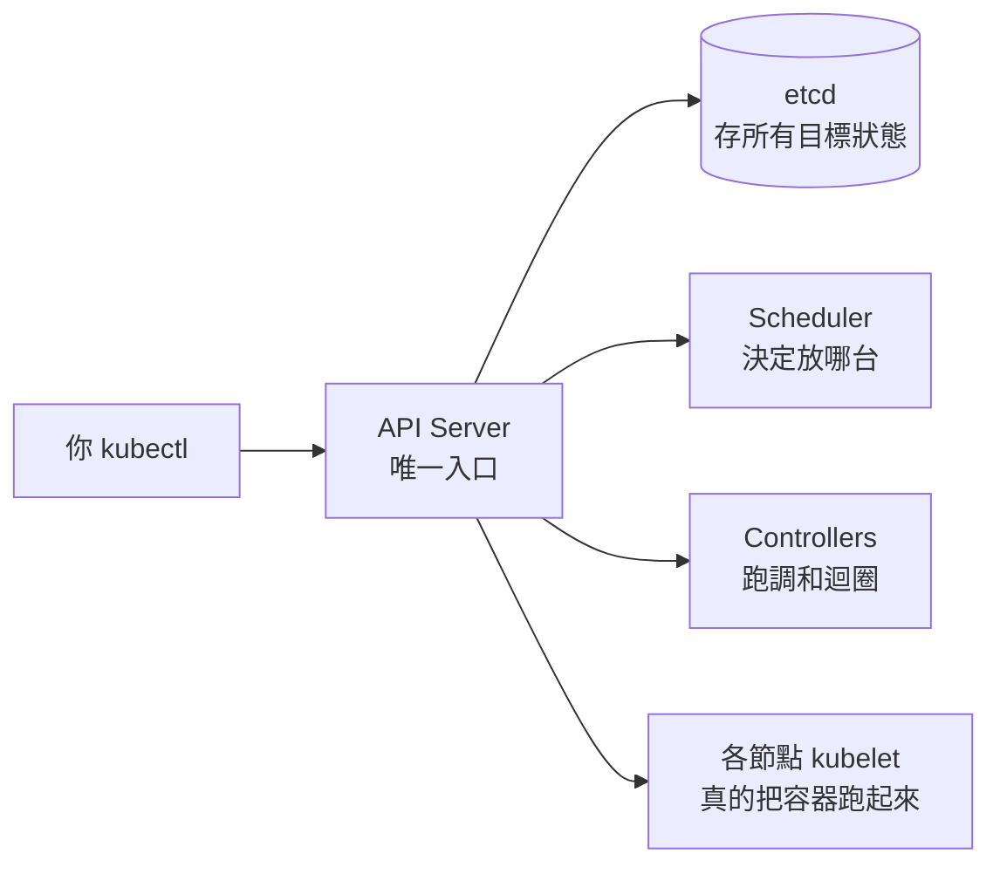

# 01 架構(概念)

> 一句話:**叢集分成「大腦(控制平面)」和「工人(節點)」,你只跟大腦說目標。**

## 解決什麼問題

你想跑容器,但不想管「哪台機器有空」「掛了誰重開」「機器死了怎麼搬」。要有個角色統一調度——這就是控制平面。

## 心智模型

- **控制平面**:`API Server`(所有指令的門)、`etcd`(叢集的記憶體,存你宣告的一切)、`Scheduler`(挑機器)、`Controllers`(顧目標)。
- **節點**:`kubelet`(聽命令、顧容器)、容器執行環境、`kube-proxy`(顧網路)。

## 一件事看穿全局

你 `kubectl apply` 之後發生什麼:**API Server 收下 → 寫進 etcd → Scheduler 挑節點 → 該節點 kubelet 把容器拉起來 → 狀態再回寫 etcd。** 全程沒有人「直接」開容器,都是各自看目標自己動。

## 一句話記住

**你對 API Server 說目標,剩下的分工是叢集自己協調的。**

---
🔧 動手做:[notes/01-architecture.md](../notes/01-architecture.md)
← [物件全圖](object-map.md)｜→ [02 kubectl](02-kubectl.md)
