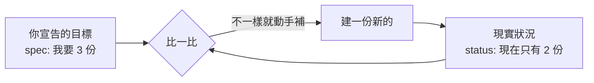

# K8s 到底在做什麼(總覽 ①)

> 一句話:**你寫下「我想要的狀態」,Kubernetes 想辦法讓現實一直維持成那樣。**

## 它解決什麼問題

你有一堆容器要跑在一堆機器上,然後你會遇到:

- 某個容器掛了,要有人自動把它重開
- 流量變大,要能快速多開幾份
- 要換新版本,又不能整個服務斷線
- 某台機器死了,上面的東西要自動搬到別台

一台兩台手動搞還行,幾十上百個就不可能了。**Kubernetes 就是那個 24 小時幫你顧這些事的自動化維運系統。**

## 最重要的心智模型:宣告式 + reconcile 迴圈

這是理解 K8s 的鑰匙,先記住:

- 你**不是**下「開一個容器」「殺掉那個」這種一步一步的命令(那叫命令式)。
- 你是**描述最終想要的樣子**:「我要 3 份這個 app 一直跑著」(這叫宣告式)。
- K8s 內部有一堆**控制器(controller)**,每個都在跑同一個迴圈:

**看目標 → 看現實 → 有差距就補 → 一直重複。** 這個「調和(reconcile)迴圈」就是 K8s 會自癒、能擴縮、能滾動更新的根本原因。你後面學的每個物件,幾乎都是這個迴圈的一種應用。

## 叢集的兩半:控制平面 vs 節點

- **控制平面(Control Plane)** = 大腦。存你宣告的目標、做決策、跑那些控制器。
- **節點(Node)** = 工人。真正把容器跑起來的機器。

你只跟大腦講話(透過 `kubectl`),工人怎麼分工是大腦決定的。

## 一句話記住

**K8s = 一個「你說目標、它自動維持」的系統。** 之後看到任何新東西,先問:「它在調和什麼目標?」

---

🔧 對應動手做:[notes/01-architecture.md](../notes/01-architecture.md)
下一篇總覽 → [核心物件全圖](object-map.md)
