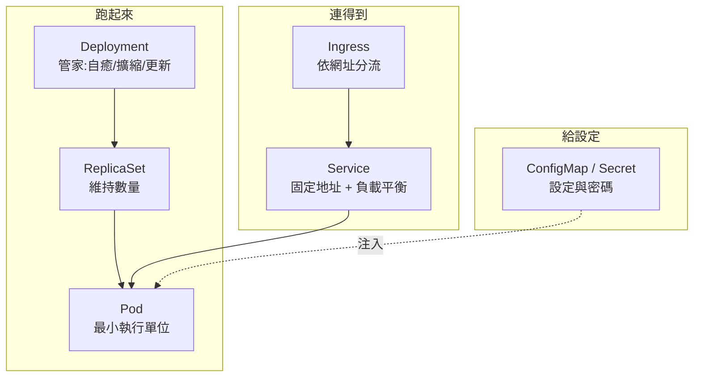

# 核心物件全圖(總覽 ②)

> 一句話:**這些物件不是一堆零散名詞,而是一條「跑起來 → 連得到 → 給設定」的鏈。**

先看這張圖,後面每一課都是在補其中一塊:

## 三個問題,三組物件

學 K8s 應用開發,其實就是依序回答三個問題:

| 問題 | 負責的物件 | 概念卡 |
| --- | --- | --- |
| **怎麼把 app 跑起來、還能自癒?** | Pod ← ReplicaSet ← Deployment | [03](03-pods.md) · [04](04-deployments.md) |
| **別人怎麼穩定連到它?** | Service(內部)→ Ingress(外部依網址) | [05](05-services.md) · [06](06-ingress.md) |
| **設定跟密碼怎麼餵進去?** | ConfigMap / Secret | [07](07-config.md) |

## 每一課是怎麼「長出下一課」的

這條學習線不是隨便排的,每一課都在補上一課留下的洞:

- **Pod** 會跑,但你手動砍掉就回不來了 → 所以要
- **Deployment** 幫它自癒、擴縮、換版本;但每次重建 **IP 都會變** → 所以要
- **Service** 給一個永遠不變的地址 + 自動分流;但它只認 IP/port、給的是醜醜的埠 → 所以要
- **Ingress** 當統一大門,依網址(host/path)分流、收 TLS;但設定還寫死在 image 裡 → 所以要
- **ConfigMap / Secret** 把設定跟密碼從 image 拆出來。

**看懂這條「因為…所以…」的鏈,比背每個物件的欄位重要一百倍。**

## 一句話記住

**跑起來(Pod/Deployment)→ 連得到(Service/Ingress)→ 給設定(Config/Secret)。** 迷路時就回來看這張圖。

---

🔧 物件細節參考:[notes/objects.md](../notes/objects.md)
上一篇總覽 → [K8s 到底在做什麼](big-picture.md)｜開始逐課 → [01 架構](01-architecture.md)
