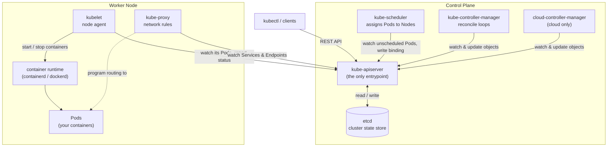
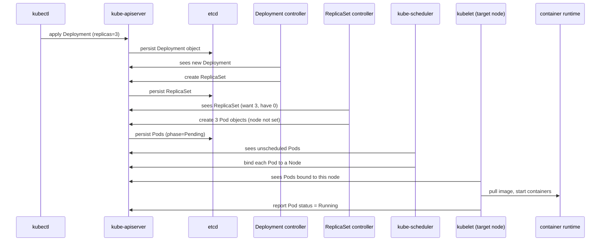

# Architecture Overview

Lesson 1. What problem Kubernetes solves, how a cluster is put together, and how
a request flows through it.

## 1. Why Kubernetes exists

Say you have a dozen containers to run across three machines. By hand you now own
a pile of questions:

- Which machine has spare CPU and memory for this container right now?
- One machine just died — who notices, and who starts its containers elsewhere?
- A container crashed at 3 a.m. — who restarts it?
- This service's replicas keep getting new IPs — how does everything that calls
  it keep up?
- Traffic tripled — who starts more replicas, and scales them back down after?
- A new version is ready — how do you roll it out without dropping requests, and
  roll back if it misbehaves?

You can answer each with scripts and a monitoring tool, but that bundle is
fragile and does not survive more machines, more services, or more people.

**Kubernetes is the control system that answers all of them from one declarative
description.** You hand it "I want 3 replicas of this image, reachable on this
name", and it keeps that true: placing containers on machines with room, moving
them when a machine fails, restarting them when they crash, giving them a stable
address, scaling on demand, and rolling updates out and back.

A useful analogy: you do not tell a thermostat "run the heater for 12 minutes".
You set 21 °C and it does whatever it takes to hold that. Kubernetes is a
thermostat for your workloads.

## 2. Declarative, not imperative

`docker run` is **imperative**: a one-off command on one host. If the container
dies or the host reboots, nothing brings it back.

Kubernetes is **declarative**: you submit an object describing the desired state,
and the cluster works continuously to make reality match it. The verb you use is
almost always `kubectl apply` ("make it look like this"), not "create this then
start that".

## 3. The reconcile loop

Every controller in Kubernetes runs the same four-step loop, forever:

1. **Observe** — read the desired state (your objects) and the actual state from
   the API server.
2. **Diff** — compare them.
3. **Act** — take one step to close the gap: create, update, or delete an object,
   or call an external system.
4. **Repeat.**

Two properties make this robust:

- Controllers **watch** the API server (a streaming subscription) rather than
  polling on a timer, so they react within milliseconds. If a watch drops, the
  controller re-lists everything and resumes — it cannot get permanently stuck.
- The loop is **level-triggered**: it acts on the current state, not on a
  one-time "something changed" event. A missed or duplicated notification is
  harmless because the next pass still converges.

## 4. spec vs. status

Almost every object has two halves:

| Field | Meaning | Written by |
| --- | --- | --- |
| `spec` | Desired state — what you want | You, or a higher-level controller |
| `status` | Observed state — what currently is | The component that owns the object |

Reconciliation is the work of driving `status` toward `spec`. When you read
`kubectl get pod ... -o yaml`, the top is what was asked for and the `status:`
block is the cluster reporting back.

## 5. A cluster = control plane + nodes

### Control plane — makes decisions, does not run your workloads

**kube-apiserver** is the front door. Every other component, and every `kubectl`
command, talks *only* to it over REST. It validates requests, applies defaults
and admission rules, and is the *only* component that reads or writes the
datastore. If it is down, nothing can change (running Pods keep running, but
nothing new gets scheduled).

**etcd** is the datastore — a distributed key-value store holding every object.
It is the single source of truth. Losing it means losing the cluster's state,
which is why etcd backups *are* cluster backups.

**kube-scheduler** watches for Pods that have been created but not yet assigned to
a node. For each one it filters nodes that *can* run it (enough resources, matches
`nodeSelector` / affinity, tolerates taints) then scores the survivors and writes
the winner back as a binding. It does not start anything — it only decides
*where*.

**kube-controller-manager** is one process running dozens of reconcile loops: the
Deployment controller, ReplicaSet controller, Node controller (notices dead
nodes), Job controller, and more. Each is small and does one job.

**cloud-controller-manager** talks to a cloud provider's API — provisioning load
balancers for `LoadBalancer` Services, attaching disks, labelling nodes with
region/zone. A local cluster has no cloud, so it is absent.

### Node — the machines that actually run containers

**kubelet** is the agent on every node. It watches the API server for Pods bound
to *its* node, tells the container runtime to pull images and start/stop
containers, runs the Pods' health probes, and continuously reports Pod and node
status back.

**container runtime** is what actually runs containers — containerd or CRI-O.
This is the role the Docker daemon played for `docker run`.

**kube-proxy** turns Service definitions into real network rules on the node
(iptables or IPVS), so that traffic to a Service's virtual IP is load-balanced
across whichever Pods currently back it.

## 6. How the components relate

Everything is **hub-and-spoke through the API server**. The scheduler,
controller-manager, kubelet, and kube-proxy **never talk to each other
directly** — each watches the API server and writes back to the API server. Only
the API server touches etcd.



## 7. What happens after `kubectl apply -f deployment.yaml`

Nobody creates a container "directly". You declare a high-level object, and a
chain of controllers each turns one layer into the next.

1. `kubectl apply` sends the Deployment to the **kube-apiserver**.
2. The apiserver validates it and **persists it to etcd**.
3. The **Deployment controller** notices a new Deployment and creates a
   **ReplicaSet**.
4. The **ReplicaSet controller** sees "want 3 Pods, have 0" and creates 3 **Pod**
   objects — still with no node assigned (`phase=Pending`).
5. The **kube-scheduler** sees the unscheduled Pods and **binds each to a node**.
6. On the target node, the **kubelet** sees Pods bound to it and tells the
   **container runtime** to pull the image and start the containers.
7. The kubelet reports each Pod's status back to the apiserver as `Running`.

Delete a Pod later and step 4's controller sees "want 3, have 2" and makes
another. That self-healing is exactly why you deploy a Deployment, not a bare
Pod.



## 8. On a local cluster (k3s)

These notes use [k3s](https://k3s.io/) in WSL2 — see
[Environment setup](environment.md). k3s is conformant Kubernetes packaged
differently for one machine:

- All control-plane components **and** the kubelet run in **one process** (the
  `k3s` binary under a `k3s.service` systemd unit).
- The datastore defaults to **embedded SQLite** instead of a separate etcd. Same
  API, same behaviour; only the storage backend differs.
- It ships with a runtime (containerd), a CNI (Flannel), an ingress controller
  (Traefik), a `local-path` storage provisioner, and CoreDNS — which is why
  `kubectl get pods -A` shows those in `kube-system` immediately after install.

Because of the single process, you will not see separate `kube-apiserver` /
`kube-scheduler` / `kube-controller-manager` Pods the way you would on a
kubeadm cluster. The responsibilities are all still there, just in one binary.

## 9. Explore the architecture yourself

```bash
# cluster endpoints and versions
kubectl cluster-info
kubectl version
kubectl get nodes -o wide

# every object type this cluster understands, and the API groups they live in
kubectl api-resources
kubectl api-versions

# ask the API server about its own health
kubectl get --raw='/healthz?verbose'
kubectl get --raw='/livez?verbose'

# the schema of any object, field by field
kubectl explain pod
kubectl explain pod.spec.containers

# see the actual REST calls kubectl makes to the API server
kubectl get pods -A -v=6      # URLs only
kubectl get pods -A -v=8      # full request/response

# which cluster and user kubectl is currently pointed at
kubectl config current-context
kubectl config view --minify

# on k3s: the control plane as a process, plus its bundled add-ons
sudo systemctl status k3s
kubectl get pods -n kube-system
```

## 10. Key takeaways

- Kubernetes solves placement, self-healing, service discovery, scaling, and
  rollouts — from **one declarative spec**.
- It works as a set of **reconcile loops** that drive `status` toward `spec`.
- The **API server** is the only hub; **etcd** (or SQLite on k3s) is the only
  source of truth.
- **Control plane decides, nodes run.** The kubelet is the per-node agent.
- You declare high-level objects; **controllers create the lower-level ones** down
  to Pods, and the scheduler + kubelet turn Pods into running containers.

## Glossary

- **Object / Resource** — something you declare in Kubernetes (Pod, Service, Deployment, ...).
- **Manifest** — a YAML file describing one or more objects.
- **Controller** — a continuously running reconcile loop.
- **Reconciliation** — driving actual state toward desired state.
- **Watch** — a streaming subscription to changes of a resource type on the API server.
- **Binding** — the object that records "this Pod runs on that node".
- **Admission** — validation/mutation the API server applies to a request before storing it.
- **Namespace** — a logical partition inside a cluster.
