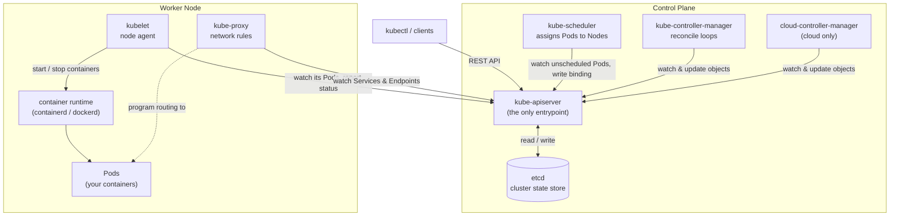
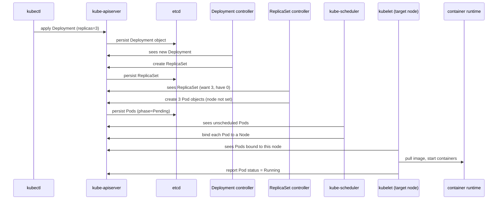

# Architecture Overview

Lesson 1. How a Kubernetes cluster is put together and how a request flows
through it.

## 1. What Kubernetes does

Running one container by hand (`docker run`) is **imperative**, single-host, and
manually supervised: you issue a command, and if the container dies or the host
reboots, nothing brings it back.

Kubernetes is **declarative**. You submit a manifest that describes a desired
state — "3 replicas of this image, exposed on this port" — and the cluster then
**works continuously to make reality match that description**: restarting crashed
containers, recreating Pods that vanish, rescheduling onto healthy nodes, scaling
up or down when you change a number.

That "keep pulling actual state toward desired state" behaviour is called
**reconciliation**. It is the single idea underneath everything else in this
document.

## 2. The reconcile loop

Every controller in Kubernetes runs the same loop:

1. **Observe** — read the desired state (your objects) and the actual state from
   the API server.
2. **Diff** — compare them.
3. **Act** — take one step to close the gap (create/update/delete an object, or
   call an external system).
4. Repeat, forever.

Controllers do not poll on a timer; they **watch** the API server and are pushed
a notification whenever a relevant object changes. A watch that drops is
re-established with a fresh list, so the loop is self-healing.

Because the loop is level-triggered (it acts on the current state, not on a
one-off event), a missed or duplicated notification is harmless — the next pass
still converges.

## 3. spec vs. status

Almost every Kubernetes object has two halves:

| Field | Meaning | Written by |
| --- | --- | --- |
| `spec` | The desired state — what you want | You (or a higher-level controller) |
| `status` | The observed state — what currently is | The controller/component that owns it |

Reconciliation is the process of driving `status` toward `spec`.

## 4. A cluster = control plane + nodes

### Control plane (makes decisions, does not run your workloads)

| Component | Responsibility |
| --- | --- |
| **kube-apiserver** | The only entrypoint. `kubectl` and every internal component talk only to it. Validates requests, exposes the REST API, and is the only thing that reads/writes etcd. |
| **etcd** | Distributed key-value store holding the **entire cluster state** — the single source of truth. |
| **kube-scheduler** | Watches for Pods with no node assigned, picks a node for each (based on free resources, affinity, taints, ...), and writes the binding back. |
| **kube-controller-manager** | One process running many reconcile loops (Deployment, ReplicaSet, Node, Job, ...), each comparing desired vs. actual and correcting the difference. |
| **cloud-controller-manager** | Integrates with a cloud provider — provisions load balancers, attaches disks, labels nodes. Absent on a local cluster. |

### Node (the machines that actually run containers)

| Component | Responsibility |
| --- | --- |
| **kubelet** | Per-node agent. Watches the API server for Pods bound to its node, tells the runtime to start/stop their containers, runs probes, and reports Pod/node status back. |
| **container runtime** | Actually runs containers (containerd, CRI-O). Same role the Docker daemon played for `docker run`. |
| **kube-proxy** | Programs the node's network rules (iptables/IPVS) so a Service's virtual IP load-balances to the current set of backing Pods. |

## 5. How the components relate

Everything is **hub-and-spoke through the API server**. The scheduler,
controller-manager, kubelet, and kube-proxy **never talk to each other
directly** — each one watches the API server and writes back to the API server.
Only the API server touches etcd.

## 6. What happens after `kubectl apply -f deployment.yaml`

Nobody creates a container "directly". You declare objects, and a chain of
controllers each turns one layer into the next.

1. `kubectl apply` sends the Deployment to the **kube-apiserver**.
2. The apiserver validates it and **persists it to etcd**.
3. The **Deployment controller** notices a new Deployment and creates a
   **ReplicaSet**.
4. The **ReplicaSet controller** sees "want 3 Pods, have 0" and creates 3 **Pod**
   objects — still with no node assigned (`phase=Pending`).
5. The **kube-scheduler** sees the unscheduled Pods and **binds each to a node**.
6. On the target node, the **kubelet** sees Pods bound to it and tells the
   **container runtime** to pull the image and start the containers.
7. The kubelet reports each Pod's status back to the apiserver as `Running`.

If you later delete a Pod, step 4's controller sees "want 3, have 2" and makes
another one. That is self-healing — and the reason you deploy a Deployment, not a
bare Pod.

## 7. Why it is called "etcd"

`etcd` = `/etc` + `d`. `/etc` is the classic Unix directory for host
configuration files; `d` stands for "distributed". So etcd is "a distributed
`/etc`" — a replicated key-value store for configuration and coordination data.
It uses the Raft consensus algorithm to keep replicas (usually 3 or 5, an odd
number so a majority can always be formed) consistent. Backing up etcd is
equivalent to backing up the whole cluster.

## 8. On a local cluster (k3s)

The study cluster for these notes is [k3s](https://k3s.io/) running inside WSL2.
k3s is a conformant Kubernetes distribution that packages the pieces above
differently for single-machine use:

- All control-plane components **and** the kubelet run inside **one process**
  (the `k3s` binary, started by a `k3s.service` systemd unit).
- The datastore defaults to **embedded SQLite** instead of a separate etcd. The
  API and behaviour are unchanged; only the storage backend differs.
- It ships with batteries included: a container runtime (containerd), a CNI
  (Flannel), an ingress controller (Traefik), a `local-path` storage provisioner,
  and CoreDNS — which is why `kubectl get pods -A` shows those in `kube-system`
  right after install.

Everything in the rest of these notes — objects, `kubectl`, YAML — behaves the
same as on a multi-node cluster.

## 9. Key takeaways

- Kubernetes is a set of **reconcile loops** that drive `status` toward `spec`.
- The **API server** is the only hub; **etcd** is the only source of truth.
- **Control plane decides, nodes run.** kubelet is the agent on each node.
- You declare high-level objects; **controllers create the lower-level ones** down
  to Pods, and the scheduler + kubelet turn Pods into running containers.

## Glossary

- **Object / Resource** — something you declare in Kubernetes (Pod, Service, Deployment, ...).
- **Manifest** — a YAML file describing one or more objects.
- **Controller** — a continuously running reconcile loop.
- **Reconciliation** — driving actual state toward desired state.
- **Watch** — a streaming subscription to changes of a resource type on the API server.
- **Binding** — the object that records "this Pod runs on that node".
- **Namespace** — a logical partition inside a cluster.
