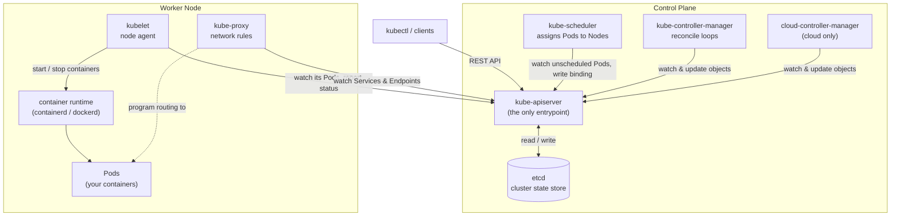
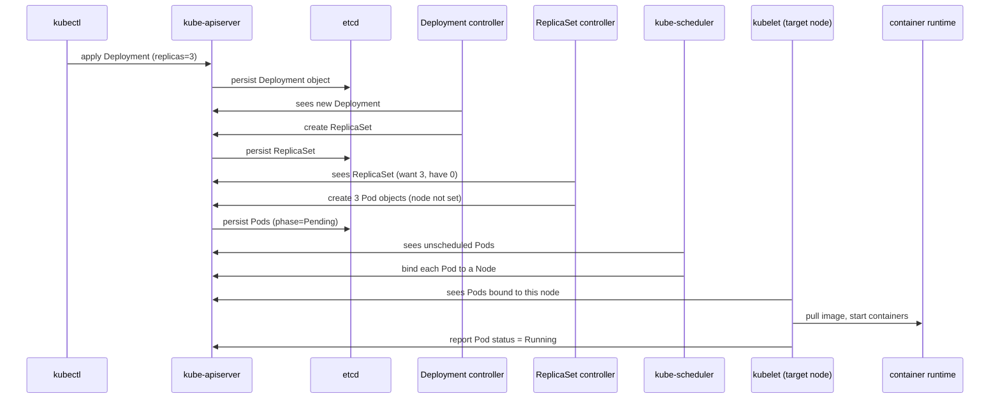

# Architecture Overview

## What Kubernetes does

Running one container by hand (`docker run`) is **imperative**, single-host, and
manually supervised.

Kubernetes is **declarative**: you write a manifest that says "I want 3 replicas
of this container, exposed on this port", hand it to the cluster, and the cluster
**continuously works to keep reality matching that request** — restarting crashed
containers, rescheduling onto healthy nodes, scaling when you change a number.
That "keep pulling current state toward desired state" loop is called
**reconciliation**, and it is the core idea behind everything in Kubernetes.

## A cluster = control plane + nodes

### Control plane (makes decisions, does not run your workloads)

| Component | Responsibility |
| --- | --- |
| **kube-apiserver** | The only entrypoint. `kubectl` and every internal component talk only to it. Exposes the REST API. |
| **etcd** | Distributed key-value store holding the **entire cluster state** — the single source of truth. |
| **kube-scheduler** | Decides which node a new Pod should run on (based on free resources and constraints). |
| **kube-controller-manager** | Runs the reconcile loops (Deployment, Node, ReplicaSet, ...), constantly comparing desired vs. actual and correcting the difference. |
| **cloud-controller-manager** | Integrates with a cloud provider (provision load balancers, attach disks). Not present on a local cluster. |

### Node (the machines that actually run containers)

| Component | Responsibility |
| --- | --- |
| **kubelet** | Per-node agent. Takes instructions from the apiserver, tells the runtime to start/stop containers, reports status back. |
| **container runtime** | Actually runs containers (containerd, CRI-O). Similar role to the Docker daemon. |
| **kube-proxy** | Maintains node network rules so a Service's virtual IP routes to the backing Pods. |

## How the components relate

Everything is hub-and-spoke through the API server. The scheduler,
controller-manager, and kubelet **do not talk to each other directly** — they all
"watch the API server, then write back to the API server". Only the API server
touches etcd.

## What happens after `kubectl apply -f deployment.yaml`

Nobody creates a container "directly". You declare objects in etcd, and a chain
of controllers each turn one layer into reality.

## Why it is called "etcd"

`etcd` = `/etc` + `d`. `/etc` is the classic Unix directory for host
configuration files; `d` stands for "distributed". So etcd is "a distributed
`/etc`" — a replicated key-value store for configuration and coordination data.
It uses the Raft consensus algorithm to keep replicas (usually 3 or 5, an odd
number for quorum) consistent. Backing up etcd is equivalent to backing up the
whole cluster.

## Glossary

- **Object / Resource** — something you declare in Kubernetes (Pod, Service, Deployment, ...).
- **Manifest** — a YAML file describing an object.
- **Controller** — a continuously running reconcile loop.
- **Namespace** — a logical partition inside a cluster.
