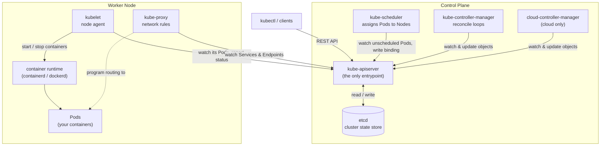
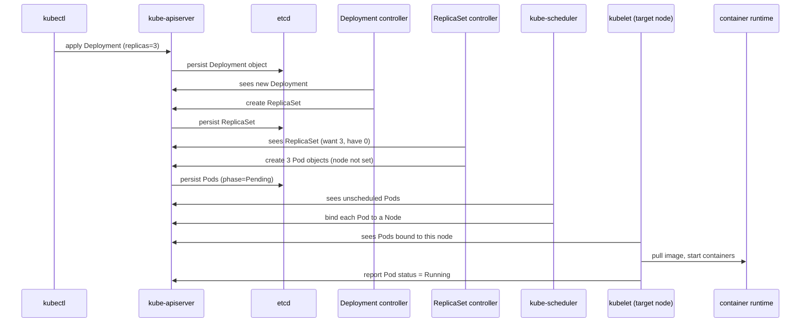

**English** · [中文](01-architecture.zh.md)

# Architecture Overview

> What problem Kubernetes solves, what a cluster is made of, and what happens
> between `kubectl apply` and a running container.

**Before this:** [Setting Up a Practice Cluster](00-environment.md)

---

# Part 1 — Walkthrough

Explore the architecture in your own cluster before reading about it.

## Who am I talking to?

```bash
kubectl config current-context
```

```
default
```

```bash
kubectl cluster-info
```

```
Kubernetes control plane is running at https://127.0.0.1:6443
CoreDNS is running at https://127.0.0.1:6443/api/v1/namespaces/kube-system/services/kube-dns:dns/proxy
Metrics-server is running at https://127.0.0.1:6443/api/v1/namespaces/kube-system/services/https:metrics-server:https/proxy
```

Everything is one address — `https://127.0.0.1:6443`, the **API server**. Even the
add-ons are reached *through* it.

## What does kubectl actually send?

```bash
kubectl get pods -v=6
```

```
I0901 02:33:23.783256  loader.go:407] Config loaded from file:  /etc/rancher/k3s/k3s.yaml
I0901 02:33:23.853796  round_trippers.go:632] "Response" verb="GET" url="https://127.0.0.1:6443/api/v1/namespaces/default/pods?limit=500" status="200 OK" milliseconds=67
NAME   READY   STATUS    RESTARTS   AGE
web    1/1     Running   0          2m6s
```

One REST call. kubectl read the kubeconfig, issued a `GET`, and formatted the
JSON. That is all it ever does.

## What can this cluster hold?

```bash
kubectl api-resources | head
```

```
NAME                     SHORTNAMES   APIVERSION   NAMESPACED   KIND
bindings                              v1           true         Binding
componentstatuses        cs           v1           false        ComponentStatus
configmaps               cm           v1           true         ConfigMap
endpoints                ep           v1           true         Endpoints
events                   ev           v1           true         Event
namespaces               ns           v1           false        Namespace
nodes                    no           v1           false        Node
persistentvolumeclaims   pvc          v1           true         PersistentVolumeClaim
persistentvolumes        pv           v1           false        PersistentVolume
pods                     po           v1           true         Pod
```

Note the `NAMESPACED` column — `nodes` and `namespaces` are cluster-wide; `pods`
and `configmaps` live inside a namespace.

## Is the control plane healthy?

```bash
kubectl get --raw='/healthz?verbose'
```

```
[+]ping ok
[+]log ok
[+]etcd ok
[+]poststarthook/start-apiserver-admission-initializer ok
[+]poststarthook/generic-apiserver-start-informers ok
[+]poststarthook/priority-and-fairness-config-consumer ok
...
healthz check passed
```

`[+]etcd ok` is the datastore check. On k3s that "etcd" is actually embedded
SQLite, but the health check name is unchanged.

## What fields does an object have?

```bash
kubectl explain pod
```

```
KIND:       Pod
VERSION:    v1

DESCRIPTION:
    Pod is a collection of containers that can run on a host. This resource is
    created by clients and scheduled onto hosts.

FIELDS:
  apiVersion    <string>
  kind          <string>
  metadata      <ObjectMeta>
  spec          <PodSpec>
  status        <PodStatus>
```

There is the **`spec` / `status`** split you will see on every object.

## Where is the control plane running?

```bash
sudo systemctl status k3s
kubectl get pods -n kube-system
```

On k3s the whole control plane is one process, so `kube-system` shows only the
bundled add-ons — no `kube-apiserver` Pod. On a kubeadm cluster you would see each
component as its own Pod here.

---

# Part 2 — How it works

## The problem being solved

Say you have a dozen containers to run across three machines. Doing it by hand
leaves you owning a pile of questions:

- Which machine has spare CPU and memory for this container *right now*?
- A machine just died — who notices, and who starts its containers elsewhere?
- A container crashed at 3 a.m. — who restarts it?
- Replicas keep getting new IPs — how does anything find them?
- Traffic tripled — who starts more replicas, and scales them back afterwards?
- A new version is ready — how do you roll it out without dropping requests, and
  roll back if it misbehaves?

Each has an answer involving scripts and a monitoring tool. That bundle is
fragile, and it does not survive more machines, more services, or more people.

**Kubernetes answers all of them from a single declarative description.** You say
"3 replicas of this image, reachable under this name", and it keeps that true.

> A thermostat analogy: you never tell a thermostat "run the heater for 12
> minutes". You set 21 °C and it does whatever it takes to hold that. Kubernetes
> is a thermostat for your workloads.

## Declarative, not imperative

`docker run` is **imperative** — a one-off command on one host. If the container
dies or the host reboots, nothing brings it back.

Kubernetes is **declarative** — you submit an object describing the state you
want, and the cluster works continuously to match it. That is why the everyday
verb is `kubectl apply` ("make it look like this"), not "create this, then start
that".

## The reconcile loop

Every controller runs the same four steps, forever:

1. **Observe** — read the desired state (your objects) and the actual state.
2. **Diff** — compare them.
3. **Act** — take one step to close the gap.
4. **Repeat.**

Two properties make this robust:

**Controllers watch, they do not poll.** A watch is a streaming subscription to
the API server, so a controller reacts within milliseconds. If the connection
drops, it re-lists everything and resumes — it cannot get permanently stuck.

**The loop is level-triggered.** It acts on the *current* state, not on a one-off
"something changed" event. A missed or duplicated notification is harmless,
because the next pass converges anyway.

## spec vs. status

Nearly every object has two halves:

| Field | Meaning | Written by |
| --- | --- | --- |
| `spec` | Desired state — what you want | You, or a higher-level controller |
| `status` | Observed state — what currently is | The component that owns the object |

Reconciliation is the work of driving `status` toward `spec`.

## The control plane

These components make decisions. They do not run your workloads.

**kube-apiserver** is the front door. Every other component — and every `kubectl`
command — talks *only* to it, over REST. It validates requests, applies defaults
and admission rules, and is the only component that reads or writes the
datastore. If it goes down, running Pods keep running but nothing new can change.

**etcd** is the datastore: a distributed key-value store holding every object, and
the single source of truth. Losing etcd means losing the cluster's state — which
is why etcd backups *are* cluster backups.

**kube-scheduler** watches for Pods that exist but have no node assigned. For each
one it filters nodes that *can* run it (enough resources, matching
`nodeSelector`/affinity, tolerating taints), scores the survivors, and writes the
winner back as a binding. It decides *where* — it never starts anything.

**kube-controller-manager** is one process running dozens of reconcile loops: the
Deployment controller, the ReplicaSet controller, the Node controller (which
notices dead nodes), the Job controller, and more. Each is small and does one job.

**cloud-controller-manager** talks to a cloud provider's API — provisioning load
balancers, attaching disks, labelling nodes with region and zone. A local cluster
has no cloud, so it is absent.

## The nodes

These run the containers.

**kubelet** is the agent on every node. It watches the API server for Pods bound
to *its* node, tells the container runtime to pull images and start or stop
containers, runs health probes, and continuously reports status back.

**container runtime** is what actually runs containers — containerd or CRI-O.
This is the role the Docker daemon played for `docker run`.

**kube-proxy** turns Service definitions into real network rules on the node
(iptables or IPVS), so traffic aimed at a Service's virtual IP is load-balanced
across whichever Pods currently back it.

## How they connect

Everything is **hub-and-spoke through the API server**. The scheduler,
controller-manager, kubelet, and kube-proxy never talk to each other directly —
each watches the API server and writes back to it. Only the API server touches
etcd.



## Following one request end to end

Nobody creates a container directly. You declare a high-level object, and a chain
of controllers each turns one layer into the next.

1. `kubectl apply` sends the Deployment to the **kube-apiserver**.
2. The apiserver validates it and **persists it to etcd**.
3. The **Deployment controller** notices it and creates a **ReplicaSet**.
4. The **ReplicaSet controller** sees "want 3 Pods, have 0" and creates 3 **Pod**
   objects — still with no node assigned (`phase=Pending`).
5. The **kube-scheduler** sees the unscheduled Pods and **binds each to a node**.
6. On that node, the **kubelet** notices Pods bound to it and tells the
   **container runtime** to pull the image and start the containers.
7. The kubelet reports each Pod's status back as `Running`.

Delete a Pod later and the controller in step 4 sees "want 3, have 2" and makes
another. That self-healing is exactly why you deploy a Deployment, not a bare Pod.



## Why "etcd"

`etcd` = `/etc` + `d`. `/etc` is the classic Unix directory for host configuration
files; `d` stands for **distributed**. So etcd is "a distributed `/etc`" — a
replicated key-value store for configuration and coordination data. It uses the
Raft consensus algorithm to keep replicas (usually 3 or 5, an odd number so a
majority can always form) consistent.

## What this looks like on k3s

Your practice cluster packages the same responsibilities differently:

- All control-plane components **and** the kubelet run in **one process** — the
  `k3s` binary under a `k3s.service` systemd unit.
- The datastore is **embedded SQLite**, not a separate etcd. Same API, same
  behaviour.
- Networking, ingress, DNS, and storage add-ons ship built in, which is why
  `kubectl get pods -A` shows Traefik and CoreDNS right after install.

Every responsibility above still exists — just inside one binary.

---

# Part 3 — Command reference

```bash
# cluster identity and endpoints
kubectl config current-context
kubectl config get-contexts
kubectl config view --minify
kubectl cluster-info
kubectl version

# nodes
kubectl get nodes
kubectl get nodes -o wide
kubectl describe node <name>

# what the cluster understands
kubectl api-resources
kubectl api-resources --namespaced=false
kubectl api-versions

# control-plane health
kubectl get --raw='/healthz?verbose'
kubectl get --raw='/livez?verbose'
kubectl get --raw='/readyz?verbose'

# object schemas
kubectl explain pod
kubectl explain pod.spec.containers
kubectl explain pod --recursive

# see the REST calls
kubectl get pods -v=6      # URLs only
kubectl get pods -v=8      # full bodies

# k3s specifics
sudo systemctl status k3s
sudo journalctl -u k3s -f
kubectl get pods -n kube-system
```

---

## Recap

- Kubernetes solves placement, self-healing, service discovery, scaling, and
  rollouts from **one declarative spec**.
- It works as a set of **reconcile loops** driving `status` toward `spec`.
- The **API server** is the only hub; **etcd** is the only source of truth.
- **The control plane decides; nodes run.** The kubelet is the per-node agent.
- You declare high-level objects; **controllers create the lower-level ones** down
  to Pods, and the scheduler plus kubelet turn Pods into running containers.

---

**Next:** [kubectl](02-kubectl.md) — driving all of this from the command line.

[Contents](../README.md) · [Object reference](objects.md)
