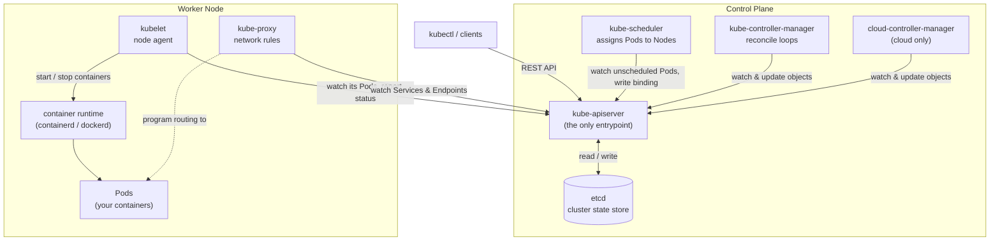
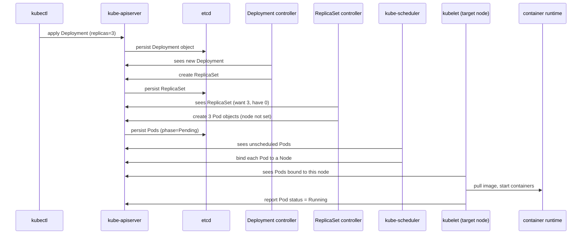

[English](01-architecture.md) · **中文**

# 架構總覽

> Kubernetes 解決什麼問題、一個叢集由什麼組成,以及從 `kubectl apply` 到容器跑起來
> 之間發生了什麼。

**前一課:** [架設練習叢集](00-environment.zh.md)

---

# Part 1 — 操作走一遍

在讀理論之前,先在你自己的叢集裡探一探架構。

## 我在跟誰講話?

```bash
kubectl config current-context
```

```
default
```

```bash
kubectl cluster-info
```

```
Kubernetes control plane is running at https://127.0.0.1:6443
CoreDNS is running at https://127.0.0.1:6443/api/v1/namespaces/kube-system/services/kube-dns:dns/proxy
Metrics-server is running at https://127.0.0.1:6443/api/v1/namespaces/kube-system/services/https:metrics-server:https/proxy
```

全部都是同一個位址 —— `https://127.0.0.1:6443`,也就是 **API server**。連附加元件都是
*透過*它來連的。

## kubectl 實際上送出了什麼?

```bash
kubectl get pods -v=6
```

```
I0901 02:33:23.783256  loader.go:407] Config loaded from file:  /etc/rancher/k3s/k3s.yaml
I0901 02:33:23.853796  round_trippers.go:632] "Response" verb="GET" url="https://127.0.0.1:6443/api/v1/namespaces/default/pods?limit=500" status="200 OK" milliseconds=67
NAME   READY   STATUS    RESTARTS   AGE
web    1/1     Running   0          2m6s
```

一次 REST 呼叫。kubectl 讀了 kubeconfig、發出一個 `GET`、把 JSON 排版出來。它做的就
只有這些。

## 這個叢集能裝哪些東西?

```bash
kubectl api-resources | head
```

```
NAME                     SHORTNAMES   APIVERSION   NAMESPACED   KIND
bindings                              v1           true         Binding
componentstatuses        cs           v1           false        ComponentStatus
configmaps               cm           v1           true         ConfigMap
endpoints                ep           v1           true         Endpoints
events                   ev           v1           true         Event
namespaces               ns           v1           false        Namespace
nodes                    no           v1           false        Node
persistentvolumeclaims   pvc          v1           true         PersistentVolumeClaim
persistentvolumes        pv           v1           false        PersistentVolume
pods                     po           v1           true         Pod
```

注意 `NAMESPACED` 這一欄 —— `nodes` 和 `namespaces` 是叢集層級的;`pods` 和
`configmaps` 則活在某個命名空間裡。

## 控制平面健康嗎?

```bash
kubectl get --raw='/healthz?verbose'
```

```
[+]ping ok
[+]log ok
[+]etcd ok
[+]poststarthook/start-apiserver-admission-initializer ok
[+]poststarthook/generic-apiserver-start-informers ok
[+]poststarthook/priority-and-fairness-config-consumer ok
...
healthz check passed
```

`[+]etcd ok` 是資料庫檢查。在 k3s 上那個「etcd」其實是內嵌的 SQLite,但健康檢查的名稱
沒變。

## 一個物件有哪些欄位?

```bash
kubectl explain pod
```

```
KIND:       Pod
VERSION:    v1

DESCRIPTION:
    Pod is a collection of containers that can run on a host. This resource is
    created by clients and scheduled onto hosts.

FIELDS:
  apiVersion    <string>
  kind          <string>
  metadata      <ObjectMeta>
  spec          <PodSpec>
  status        <PodStatus>
```

這裡就是你在每個物件上都會看到的 **`spec` / `status`** 之分。

## 控制平面跑在哪?

```bash
sudo systemctl status k3s
kubectl get pods -n kube-system
```

在 k3s 上整個控制平面是一個行程,所以 `kube-system` 只會看到內建的附加元件 —— 沒有
`kube-apiserver` 這個 Pod。在 kubeadm 叢集上,你會在這裡看到每個元件各自是一個 Pod。

---

# Part 2 — 原理說明

## 它要解決的問題

假設你有十幾個容器要跑在三台機器上。純手動做,你會擁有一堆問題:

- *現在這一刻*哪台機器還有 CPU 和記憶體能跑這個容器?
- 一台機器剛剛掛了 —— 誰會發現?誰負責在別台把它的容器起回來?
- 半夜三點某個容器崩了 —— 誰重啟它?
- 副本(replica)一直拿到新 IP —— 別的東西要怎麼找到它們?
- 流量暴增三倍 —— 誰去多開副本,事後又縮回去?
- 新版本好了 —— 怎麼在不丟請求的情況下滾動更新?出問題又怎麼回滾?

每個問題都有個「腳本 + 監控工具」的答案。那一整包很脆弱,而且撐不過更多機器、更多
服務、更多人。

**Kubernetes 用一份宣告式的描述,一次回答了全部。** 你說「這個 image 要 3 份、用這個
名字連得到」,它就一直維持成那樣。

> 溫度計比喻:你不會跟溫控器說「把暖氣開 12 分鐘」。你設 21 °C,它就想盡辦法維持在那
> 個溫度。Kubernetes 就是你工作負載的溫控器。

## 宣告式,不是命令式

`docker run` 是**命令式**的 —— 在一台主機上的一次性命令。容器死了或主機重開,沒有東西
會把它救回來。

Kubernetes 是**宣告式**的 —— 你提交一個描述「你想要的狀態」的物件,叢集就持續運作去
符合它。這就是為什麼日常動詞是 `kubectl apply`(「弄成這樣」),而不是「先建這個、再
啟動那個」。

## 調和(reconcile)迴圈

每個控制器都永遠在跑同樣的四步:

1. **觀察** —— 讀取想要的狀態(你的物件)和實際的狀態。
2. **比對** —— 比較兩者。
3. **動作** —— 採取一步去縮小差距。
4. **重複。**

有兩個特性讓它很穩健:

**控制器用 watch,不用 poll。** watch 是對 API server 的串流訂閱,所以控制器在毫秒級
就反應。連線斷了,它會重新列出全部再繼續 —— 不會永久卡住。

**這個迴圈是 level-triggered(看狀態,不是看事件)。** 它針對的是*當下*的狀態,不是
一次性的「有東西變了」事件。漏掉或重複一個通知都無害,因為下一輪反正會收斂。

## spec vs. status

幾乎每個物件都有兩半:

| 欄位 | 意義 | 由誰寫 |
| --- | --- | --- |
| `spec` | 想要的狀態 —— 你要什麼 | 你,或某個更高層的控制器 |
| `status` | 觀察到的狀態 —— 現在是什麼 | 擁有這個物件的元件 |

調和,就是把 `status` 推向 `spec` 的工作。

## 控制平面

這些元件負責決策。它們不跑你的工作負載。

**kube-apiserver** 是大門。其他每個元件 —— 以及每個 `kubectl` 指令 —— 都*只*跟它講話,
走 REST。它驗證請求、套用預設值與准入規則,而且是唯一會讀寫資料庫的元件。它掛掉的話,
正在跑的 Pod 會繼續跑,但沒有新東西能改變。

**etcd** 是資料庫:一個分散式的 key-value store,存放每個物件,是唯一的真相來源。失去
etcd 就是失去叢集的狀態 —— 所以 etcd 備份*就是*叢集備份。

**kube-scheduler** 盯著那些「存在但還沒指派節點」的 Pod。對每一個,它篩出*能*跑它的
節點(資源夠、符合 `nodeSelector`/affinity、容忍 taint),幫存活者評分,把贏家寫回成
一個 binding。它決定*放哪* —— 從不啟動任何東西。

**kube-controller-manager** 是一個行程,裡面跑著幾十個調和迴圈:Deployment 控制器、
ReplicaSet 控制器、Node 控制器(它會發現死掉的節點)、Job 控制器等等。每個都很小,只做
一件事。

**cloud-controller-manager** 跟雲端供應商的 API 講話 —— 開負載平衡器、掛載磁碟、幫節點
標上 region 和 zone。本機叢集沒有雲,所以它不存在。

## 節點

這些負責跑容器。

**kubelet** 是每個節點上的代理。它盯著 API server 看有沒有 Pod 被綁到*它自己*的節點,
叫容器執行環境去拉 image、啟停容器,跑健康探測,並持續回報狀態。

**container runtime(容器執行環境)** 才是真正在跑容器的東西 —— containerd 或 CRI-O。
這就是 `docker run` 時 Docker daemon 扮演的角色。

**kube-proxy** 把 Service 定義變成節點上真正的網路規則(iptables 或 IPVS),讓打向
Service 虛擬 IP 的流量,被負載平衡到當下支撐它的那些 Pod。

## 它們怎麼串接

一切都是**以 API server 為中心的輻射狀(hub-and-spoke)**。scheduler、
controller-manager、kubelet、kube-proxy 彼此從不直接對話 —— 每個都盯著 API server 看、
也寫回給它。只有 API server 碰 etcd。



## 從頭到尾追一個請求

沒有人會直接建立一個容器。你宣告一個高層物件,然後一連串的控制器,每一個都把一層轉成
下一層。

1. `kubectl apply` 把 Deployment 送給 **kube-apiserver**。
2. apiserver 驗證它,並**存進 etcd**。
3. **Deployment 控制器**發現它,建立一個 **ReplicaSet**。
4. **ReplicaSet 控制器**看到「想要 3 個 Pod,現有 0 個」,建立 3 個 **Pod** 物件 ——
   還沒指派節點(`phase=Pending`)。
5. **kube-scheduler** 看到這些未排程的 Pod,**把每一個綁到某個節點**。
6. 在那個節點上,**kubelet** 發現有 Pod 被綁到它,叫**容器執行環境**去拉 image、啟動
   容器。
7. kubelet 把每個 Pod 的狀態回報成 `Running`。

之後刪掉一個 Pod,第 4 步的控制器看到「想要 3、現有 2」,就再造一個。這種自癒,正是你
要部署 Deployment、而不是裸 Pod 的原因。



## 為什麼叫「etcd」

`etcd` = `/etc` + `d`。`/etc` 是 Unix 上放主機設定檔的經典目錄;`d` 代表
**distributed(分散式)**。所以 etcd 是「分散式的 `/etc`」—— 一個放設定與協調資料的
複製式 key-value store。它用 Raft 共識演算法讓各副本(通常 3 或 5 個,取奇數才能永遠
湊出多數)保持一致。

## 在 k3s 上長什麼樣

你的練習叢集把同樣的職責用不同方式打包:

- 所有控制平面元件**和** kubelet 都跑在**一個行程**裡 —— 也就是 `k3s.service` systemd
  單元下的 `k3s` binary。
- 資料庫是**內嵌的 SQLite**,不是獨立的 etcd。同樣的 API、同樣的行為。
- 網路、ingress、DNS、儲存等附加元件都內建了,這就是為什麼裝完馬上
  `kubectl get pods -A` 就看得到 Traefik 和 CoreDNS。

上面每一個職責都還在 —— 只是塞進了一個 binary 裡。

---

# Part 3 — 指令參考

```bash
# 叢集身分與端點
kubectl config current-context
kubectl config get-contexts
kubectl config view --minify
kubectl cluster-info
kubectl version

# 節點
kubectl get nodes
kubectl get nodes -o wide
kubectl describe node <name>

# 這個叢集認得哪些東西
kubectl api-resources
kubectl api-resources --namespaced=false
kubectl api-versions

# 控制平面健康
kubectl get --raw='/healthz?verbose'
kubectl get --raw='/livez?verbose'
kubectl get --raw='/readyz?verbose'

# 物件結構
kubectl explain pod
kubectl explain pod.spec.containers
kubectl explain pod --recursive

# 看實際的 REST 呼叫
kubectl get pods -v=6      # 只看 URL
kubectl get pods -v=8      # 完整內容

# k3s 專屬
sudo systemctl status k3s
sudo journalctl -u k3s -f
kubectl get pods -n kube-system
```

---

## 重點回顧

- Kubernetes 用**一份宣告式的 spec**,解決排程、自癒、服務探索、擴縮、滾動更新。
- 它以一組**調和迴圈**運作,把 `status` 推向 `spec`。
- **API server** 是唯一的中樞;**etcd** 是唯一的真相來源。
- **控制平面決策;節點執行。** kubelet 是每個節點上的代理。
- 你宣告高層物件;**控制器把它們一路建成更低層的物件**直到 Pod,再由 scheduler 加
  kubelet 把 Pod 變成真正在跑的容器。

---

**下一課:** [kubectl](02-kubectl.zh.md) —— 從命令列駕馭這一切。

[目錄](../README.md) · [物件參考](objects.zh.md)
