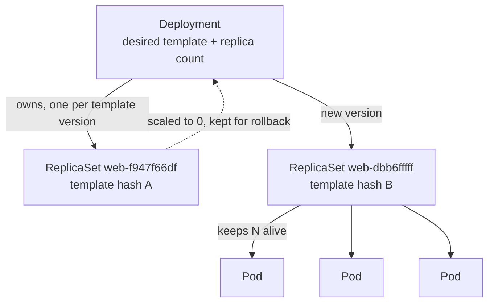

# Deployments

> The owner that keeps your Pods alive, lets you scale them, and rolls out new
> versions without downtime.

**Before this:** [Pods](03-pods.md)

In the Pods lesson you deleted a bare Pod and nothing brought it back — the
kubelet restarts *containers*, but nothing recreates a *Pod*. A Deployment is the
thing that fills that gap. You declare "I want 3 copies of this Pod running," and
a controller works continuously to make reality match that number.

---

# Part 1 — Walkthrough

Do these in order. Expected output is shown after each command. The manifest is
[`playground/deployment.yaml`](../playground/deployment.yaml).

## Create a Deployment

```bash
kubectl apply -f playground/deployment.yaml
```

```
deployment.apps/web created
```

Now look at what you got. One command created three layers of objects:

```bash
kubectl get deployments
```

```
NAME   READY   UP-TO-DATE   AVAILABLE   AGE
web    3/3     3            3           25s
```

```bash
kubectl get rs
```

```
NAME            DESIRED   CURRENT   READY   AGE
web-f947f66df   3         3         3       25s
```

```bash
kubectl get pods -o wide
```

```
NAME                  READY   STATUS    RESTARTS   AGE   IP           NODE     NOMINATED NODE   READINESS GATES
web-f947f66df-dhtxm   1/1     Running   0          23s   10.42.0.13   hankpc   <none>           <none>
web-f947f66df-kssqm   1/1     Running   0          23s   10.42.0.14   hankpc   <none>           <none>
web-f947f66df-vh24k   1/1     Running   0          23s   10.42.0.12   hankpc   <none>           <none>
```

You asked for **one** Deployment. It created **one** ReplicaSet
(`web-f947f66df`), which created **three** Pods. The Pod names are
`<replicaset-name>-<random>`, and the ReplicaSet name is
`<deployment-name>-<template-hash>`. That hash is a fingerprint of the Pod
template — remember it, it becomes important during updates.

## Prove the ownership chain

The names hint at the hierarchy; the `ownerReferences` field makes it explicit.

```bash
kubectl get pod web-f947f66df-dhtxm -o jsonpath='{.metadata.ownerReferences[0].kind}/{.metadata.ownerReferences[0].name}'
```

```
ReplicaSet/web-f947f66df
```

```bash
kubectl get rs web-f947f66df -o jsonpath='{.metadata.ownerReferences[0].kind}/{.metadata.ownerReferences[0].name}'
```

```
Deployment/web
```

So the chain is **Deployment → ReplicaSet → Pod**, each object pointing up at its
owner. This is what makes cascading delete work: delete the Deployment and
Kubernetes garbage-collects everything that traces back up to it.

## The payoff: delete a Pod and watch it come back

This is the exact experiment from the Pods lesson — except now the Pod has an
owner.

```bash
kubectl delete pod web-f947f66df-dhtxm
```

```
pod "web-f947f66df-dhtxm" deleted from default namespace
```

```bash
kubectl get pods
```

```
NAME                  READY   STATUS    RESTARTS   AGE
web-f947f66df-5k5hp   1/1     Running   0          1s
web-f947f66df-kssqm   1/1     Running   0          30s
web-f947f66df-vh24k   1/1     Running   0          30s
```

A brand-new Pod (`web-f947f66df-5k5hp`, **AGE 1s**) has already taken the deleted
one's place. Nobody watched, nobody re-ran a command — the ReplicaSet noticed it
had 2 Pods when it wanted 3 and created a replacement within a second. That is
self-healing, and it is the whole reason Deployments exist.

## Scale up and down

```bash
kubectl scale deployment web --replicas=5
```

```
deployment.apps/web scaled
```

```bash
kubectl get pods
```

```
NAME                  READY   STATUS    RESTARTS   AGE
web-f947f66df-5k5hp   1/1     Running   0          23s
web-f947f66df-5m4d5   1/1     Running   0          5s
web-f947f66df-8dr9w   1/1     Running   0          5s
web-f947f66df-kssqm   1/1     Running   0          52s
web-f947f66df-vh24k   1/1     Running   0          52s
```

Two new Pods (AGE 5s) appear. Scale back down and two of them are removed:

```bash
kubectl scale deployment web --replicas=3
```

```
deployment.apps/web scaled
```

Scaling is nothing more than changing one number in the spec. The controller does
the arithmetic — "I have 5, I want 3, delete 2" — and picks which Pods to remove.

## Roll out a new version

Change the container image. The default strategy replaces Pods **gradually**, so
the service never drops to zero.

```bash
kubectl set image deployment/web web=nginx:1.27-alpine
```

```
deployment.apps/web image updated
```

Watch the rollout happen in real time:

```bash
kubectl rollout status deployment/web
```

```
Waiting for deployment "web" rollout to finish: 1 out of 3 new replicas have been updated...
Waiting for deployment "web" rollout to finish: 2 out of 3 new replicas have been updated...
Waiting for deployment "web" rollout to finish: 1 old replicas are pending termination...
deployment "web" successfully rolled out
```

Look at the ReplicaSets now — there are two:

```bash
kubectl get rs
```

```
NAME            DESIRED   CURRENT   READY   AGE
web-dbb6fffff   3         3         3       19s
web-f947f66df   0         0         0       81s
```

The update did **not** edit the old Pods in place. It created a **new**
ReplicaSet (`web-dbb6fffff`, a different template hash because the image changed),
scaled it up to 3, and scaled the old one (`web-f947f66df`) down to 0. The old
ReplicaSet is kept at 0 — that is your rollback history.

The Deployment's own events narrate the whole interleaved dance:

```bash
kubectl describe deployment web
```

```
Events:
  Type    Reason             Age   From                   Message
  ----    ------             ----  ----                   -------
  Normal  ScalingReplicaSet  53s   deployment-controller  Scaled up replica set web-dbb6fffff from 0 to 1
  Normal  ScalingReplicaSet  36s   deployment-controller  Scaled down replica set web-f947f66df from 3 to 2
  Normal  ScalingReplicaSet  36s   deployment-controller  Scaled up replica set web-dbb6fffff from 1 to 2
  Normal  ScalingReplicaSet  35s   deployment-controller  Scaled down replica set web-f947f66df from 2 to 1
  Normal  ScalingReplicaSet  35s   deployment-controller  Scaled up replica set web-dbb6fffff from 2 to 3
  Normal  ScalingReplicaSet  35s   deployment-controller  Scaled down replica set web-f947f66df from 1 to 0
```

New up, old down, one step at a time. At every moment at least a few Pods are
serving. That is a rolling update.

## Roll back a bad version

Suppose `1.27` was a mistake. Every rollout is recorded:

```bash
kubectl rollout history deployment/web
```

```
REVISION  CHANGE-CAUSE
2         <none>
3         <none>
```

(`CHANGE-CAUSE` is `<none>` because we did not annotate the change — see Part 3
for how to fill it in.) Undo the last rollout:

```bash
kubectl rollout undo deployment/web
```

```
deployment.apps/web rolled back
```

```bash
kubectl get deployment web -o jsonpath='{.spec.template.spec.containers[0].image}'
```

```
nginx:1.25-alpine
```

Back to the old image. And because the old ReplicaSet was still sitting there at 0
replicas, the rollback is just "scale `web-f947f66df` back up to 3, scale the new
one down to 0" — fast, because nothing had to be rebuilt.

## Clean up

```bash
kubectl delete -f playground/deployment.yaml
```

```
deployment.apps "web" deleted
```

Deleting the Deployment cascades: the ReplicaSets and all their Pods go with it.

---

# Part 2 — How it works

## Two controllers, two jobs

A Deployment does not manage Pods directly. There are two nested control loops:

- The **Deployment controller** manages **ReplicaSets**. Its job is versioning:
  when the Pod template changes, it creates a new ReplicaSet and shifts replicas
  from the old one to the new one according to the rollout strategy.
- The **ReplicaSet controller** manages **Pods**. Its only job is counting: keep
  exactly `replicas` Pods that match its selector alive, no more, no less.

This is why you saw a new ReplicaSet appear on the image change but not on a
scale: scaling changes a *number* (ReplicaSet's job), updating changes the
*template* (Deployment's job).



## The reconcile loop, again

This is the same spec-vs-status reconcile loop from the architecture lesson,
applied twice. You edit the **spec** (`replicas: 3`, `image: nginx:1.27`). The
controllers observe the **status** (how many Pods actually exist, which image
they run) and take one small action to close the gap, over and over, until spec
and status agree.

You never tell Kubernetes *how* to get from 3 old Pods to 3 new ones. You declare
the desired end state and the controller figures out the steps. That is the
declarative model: **describe the destination, not the route.**

## Why the template hash matters

The `pod-template-hash` in every ReplicaSet and Pod name is a hash of the Pod
template. It is how the Deployment tells its ReplicaSets apart and how each
ReplicaSet knows which Pods are "its own." Change the template (image, env, ports,
labels…) and the hash changes, which is exactly what triggers a new ReplicaSet
and a rollout. Change nothing but the replica count and the hash stays the same —
so no rollout, just a resize.

## The rolling update strategy

The default `strategy.type` is `RollingUpdate`, governed by two knobs:

| Field | Default | Meaning |
| --- | --- | --- |
| `maxUnavailable` | 25% | How many Pods may be **down** during the rollout |
| `maxSurge` | 25% | How many **extra** Pods may exist above `replicas` |

With 3 replicas these round to "take at most 1 down, add at most 1 extra," which
is why the rollout moved one Pod at a time. The alternative, `type: Recreate`,
kills every old Pod before starting any new one — simpler, but with a moment of
full downtime. Use it only when two versions cannot run at once.

## What still isn't solved

Every Pod got a **new IP** each time it was recreated (`10.42.0.12`,`.13`,`.14`…),
and after a rollout the whole set of IPs is different. Nothing that wants to *talk*
to these Pods could rely on those addresses. Deployments keep Pods **running**;
they do nothing to give them a **stable address**. That is the next lesson —
Services.

---

# Part 3 — Command reference

### Create and inspect

```bash
kubectl apply -f playground/deployment.yaml   # create/update from manifest
kubectl get deployments                        # high-level: READY / UP-TO-DATE / AVAILABLE
kubectl get rs                                 # the ReplicaSets it owns
kubectl get pods -o wide                       # the Pods, with IP and node
kubectl describe deployment web                # spec + conditions + events
```

The `get deployments` columns: **READY** = running/desired, **UP-TO-DATE** =
Pods on the latest template, **AVAILABLE** = Pods that passed readiness.

### Scale

```bash
kubectl scale deployment web --replicas=5      # imperative resize
# or edit replicas in the manifest and re-apply (declarative, preferred)
```

### Update the image / template

```bash
kubectl set image deployment/web web=nginx:1.27-alpine   # imperative
kubectl edit deployment web                              # open the live spec in $EDITOR
# or change the manifest and kubectl apply -f (declarative, preferred)
```

`web=...` is `<container-name>=<image>`. For real work, change the manifest and
`apply` so the change is in version control — the imperative forms are for quick
experiments.

### Watch, pause, resume a rollout

```bash
kubectl rollout status deployment/web          # block until the rollout finishes
kubectl rollout pause deployment/web           # stop mid-rollout (e.g. to canary)
kubectl rollout resume deployment/web          # continue a paused rollout
kubectl rollout restart deployment/web         # re-roll every Pod (no template change)
```

`rollout restart` is the clean way to force fresh Pods — e.g. to pick up a new
`ConfigMap` or `Secret` — without editing the template.

### History and rollback

```bash
kubectl rollout history deployment/web             # list revisions
kubectl rollout history deployment/web --revision=2   # detail of one revision
kubectl rollout undo deployment/web                # roll back to previous
kubectl rollout undo deployment/web --to-revision=2   # roll back to a specific one
```

To make `CHANGE-CAUSE` meaningful, annotate the change (the old `--record` flag is
deprecated):

```bash
kubectl annotate deployment/web kubernetes.io/change-cause="bump nginx to 1.27" --overwrite
```

### Discovering fields

```bash
kubectl explain deployment.spec
kubectl explain deployment.spec.strategy.rollingUpdate
```

---

## Recap

- A Deployment declares a desired Pod template and replica count; two nested
  controllers (**Deployment → ReplicaSet → Pod**) work to make it true.
- Delete a managed Pod and the ReplicaSet **recreates it** — the self-healing the
  bare Pod never had.
- **Scaling** changes a number (same ReplicaSet); **updating** changes the
  template (new ReplicaSet, rolling replacement). The `pod-template-hash` is what
  distinguishes them.
- Old ReplicaSets are kept at 0 replicas as **rollback history**; `rollout undo`
  is just scaling one back up.
- Deployments keep Pods **running** but give them **no stable address** — Pod IPs
  churn on every recreate. Services solve that next.

---

**Next:** Services — a stable address and load balancing in front of a churning
set of Pods.

[Contents](../README.md) · [Object reference](objects.md) ·
[Troubleshooting](troubleshooting.md)
