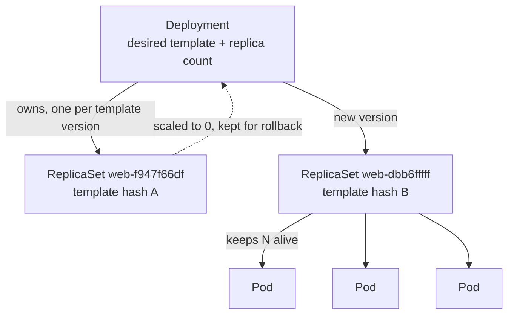

[English](04-deployments.md) · **中文**

# Deployment

> 讓你的 Pod 保持存活、能擴縮、還能不中斷地滾動更新新版本的擁有者。

**前一課:** [Pod](03-pods.zh.md)

在 Pod 那一課,你刪掉一個裸 Pod,沒有東西把它救回來 —— kubelet 會重啟*容器*,但沒有
東西會重建一個 *Pod*。Deployment 就是來補這個洞的。你宣告「我要 3 份這個 Pod 一直跑
著」,然後一個控制器就持續運作,讓現實符合這個數字。

---

# Part 1 — 操作走一遍

依序做。每個指令後面附上預期輸出。manifest 是
[`playground/deployment.yaml`](../playground/deployment.yaml)。

## 建立一個 Deployment

```bash
kubectl apply -f playground/deployment.yaml
```

```
deployment.apps/web created
```

現在看你得到了什麼。一個指令建立了三層物件:

```bash
kubectl get deployments
```

```
NAME   READY   UP-TO-DATE   AVAILABLE   AGE
web    3/3     3            3           25s
```

```bash
kubectl get rs
```

```
NAME            DESIRED   CURRENT   READY   AGE
web-f947f66df   3         3         3       25s
```

```bash
kubectl get pods -o wide
```

```
NAME                  READY   STATUS    RESTARTS   AGE   IP           NODE     NOMINATED NODE   READINESS GATES
web-f947f66df-dhtxm   1/1     Running   0          23s   10.42.0.13   hankpc   <none>           <none>
web-f947f66df-kssqm   1/1     Running   0          23s   10.42.0.14   hankpc   <none>           <none>
web-f947f66df-vh24k   1/1     Running   0          23s   10.42.0.12   hankpc   <none>           <none>
```

你只要求了**一個** Deployment。它建了**一個** ReplicaSet(`web-f947f66df`),ReplicaSet
又建了**三個** Pod。Pod 的名字是 `<replicaset-name>-<random>`,而 ReplicaSet 的名字是
`<deployment-name>-<template-hash>`。那個 hash 是 Pod 模板的指紋 —— 記住它,更新時它會
變得很重要。

## 驗證所有權鏈

名字暗示了階層;`ownerReferences` 欄位把它講白。

```bash
kubectl get pod web-f947f66df-dhtxm -o jsonpath='{.metadata.ownerReferences[0].kind}/{.metadata.ownerReferences[0].name}'
```

```
ReplicaSet/web-f947f66df
```

```bash
kubectl get rs web-f947f66df -o jsonpath='{.metadata.ownerReferences[0].kind}/{.metadata.ownerReferences[0].name}'
```

```
Deployment/web
```

所以這條鏈是 **Deployment → ReplicaSet → Pod**,每個物件都指向上面的擁有者。這就是連鎖
刪除能運作的原因:刪掉 Deployment,Kubernetes 會把所有往上追溯得到它的東西一起回收。

## 重頭戲:刪掉一個 Pod,看它回來

這正是 Pod 那一課的實驗 —— 只是這次 Pod 有了擁有者。

```bash
kubectl delete pod web-f947f66df-dhtxm
```

```
pod "web-f947f66df-dhtxm" deleted from default namespace
```

```bash
kubectl get pods
```

```
NAME                  READY   STATUS    RESTARTS   AGE
web-f947f66df-5k5hp   1/1     Running   0          1s
web-f947f66df-kssqm   1/1     Running   0          30s
web-f947f66df-vh24k   1/1     Running   0          30s
```

一個全新的 Pod(`web-f947f66df-5k5hp`,**AGE 1s**)已經頂上被刪掉那個的位置。沒有人在
看、沒有人重下指令 —— ReplicaSet 發現自己只有 2 個 Pod、但想要 3 個,一秒內就造了一個
替補。這就是自癒,也是 Deployment 存在的全部理由。

## 擴大與縮小

```bash
kubectl scale deployment web --replicas=5
```

```
deployment.apps/web scaled
```

```bash
kubectl get pods
```

```
NAME                  READY   STATUS    RESTARTS   AGE
web-f947f66df-5k5hp   1/1     Running   0          23s
web-f947f66df-5m4d5   1/1     Running   0          5s
web-f947f66df-8dr9w   1/1     Running   0          5s
web-f947f66df-kssqm   1/1     Running   0          52s
web-f947f66df-vh24k   1/1     Running   0          52s
```

兩個新 Pod(AGE 5s)出現。縮回去,其中兩個就被移除:

```bash
kubectl scale deployment web --replicas=3
```

```
deployment.apps/web scaled
```

擴縮不過就是改 spec 裡的一個數字。控制器做算術 —— 「我有 5、要 3、刪 2」—— 並挑出要
移除哪些 Pod。

## 滾動更新到新版本

改容器 image。預設策略會**漸進地**替換 Pod,所以服務永遠不會掉到零。

```bash
kubectl set image deployment/web web=nginx:1.27-alpine
```

```
deployment.apps/web image updated
```

即時看 rollout 發生:

```bash
kubectl rollout status deployment/web
```

```
Waiting for deployment "web" rollout to finish: 1 out of 3 new replicas have been updated...
Waiting for deployment "web" rollout to finish: 2 out of 3 new replicas have been updated...
Waiting for deployment "web" rollout to finish: 1 old replicas are pending termination...
deployment "web" successfully rolled out
```

現在看 ReplicaSet —— 有兩個:

```bash
kubectl get rs
```

```
NAME            DESIRED   CURRENT   READY   AGE
web-dbb6fffff   3         3         3       19s
web-f947f66df   0         0         0       81s
```

這次更新**沒有**原地改舊 Pod。它建了一個**新的** ReplicaSet(`web-dbb6fffff`,因為
image 變了所以 template hash 不同),把它擴到 3,再把舊的(`web-f947f66df`)縮到 0。
舊 ReplicaSet 保留在 0 —— 那就是你的回滾歷史。

Deployment 自己的事件記錄了整段交錯的過程:

```bash
kubectl describe deployment web
```

```
Events:
  Type    Reason             Age   From                   Message
  ----    ------             ----  ----                   -------
  Normal  ScalingReplicaSet  53s   deployment-controller  Scaled up replica set web-dbb6fffff from 0 to 1
  Normal  ScalingReplicaSet  36s   deployment-controller  Scaled down replica set web-f947f66df from 3 to 2
  Normal  ScalingReplicaSet  36s   deployment-controller  Scaled up replica set web-dbb6fffff from 1 to 2
  Normal  ScalingReplicaSet  35s   deployment-controller  Scaled down replica set web-f947f66df from 2 to 1
  Normal  ScalingReplicaSet  35s   deployment-controller  Scaled up replica set web-dbb6fffff from 2 to 3
  Normal  ScalingReplicaSet  35s   deployment-controller  Scaled down replica set web-f947f66df from 1 to 0
```

新的往上、舊的往下,一步一步來。任何一刻都至少有幾個 Pod 在服務。這就是滾動更新。

## 回滾一個壞版本

假設 `1.27` 是個錯誤。每次 rollout 都有記錄:

```bash
kubectl rollout history deployment/web
```

```
REVISION  CHANGE-CAUSE
2         <none>
3         <none>
```

(`CHANGE-CAUSE` 是 `<none>`,因為我們沒有為這次變更加註記 —— 看 Part 3 怎麼填。)
回退上一次 rollout:

```bash
kubectl rollout undo deployment/web
```

```
deployment.apps/web rolled back
```

```bash
kubectl get deployment web -o jsonpath='{.spec.template.spec.containers[0].image}'
```

```
nginx:1.25-alpine
```

回到舊 image 了。而且因為舊 ReplicaSet 一直停在 0 replicas 沒被刪,回滾就只是「把
`web-f947f66df` 擴回 3、把新的縮回 0」—— 很快,因為不用重建任何東西。

## 清理

```bash
kubectl delete -f playground/deployment.yaml
```

```
deployment.apps "web" deleted
```

刪掉 Deployment 會連鎖:ReplicaSet 和它們所有的 Pod 一起消失。

---

# Part 2 — 原理說明

## 兩個控制器,兩份工作

Deployment 不直接管 Pod。這裡有兩層巢狀的控制迴圈:

- **Deployment 控制器**管 **ReplicaSet**。它的工作是版本控制:當 Pod 模板改變時,它建
  一個新 ReplicaSet,並依 rollout 策略把 replica 從舊的移到新的。
- **ReplicaSet 控制器**管 **Pod**。它唯一的工作是數數:讓符合它 selector 的 Pod 精確
  維持在 `replicas` 個,不多不少。

這就是為什麼你在改 image 時看到新 ReplicaSet 出現、但擴縮時沒有:擴縮改的是*數字*
(ReplicaSet 的工作),更新改的是*模板*(Deployment 的工作)。



## 又見調和迴圈

這就是架構那一課的 spec-vs-status 調和迴圈,套用了兩次。你編輯 **spec**(`replicas: 3`、
`image: nginx:1.27`)。控制器觀察 **status**(實際有幾個 Pod、跑哪個 image),採取一小步
去縮小差距,一次又一次,直到 spec 和 status 一致。

你從不告訴 Kubernetes *怎麼*從 3 個舊 Pod 變成 3 個新 Pod。你宣告想要的最終狀態,控制器
自己想出步驟。這就是宣告式模型:**描述目的地,不是路線。**

## 為什麼 template hash 很重要

每個 ReplicaSet 和 Pod 名字裡的 `pod-template-hash` 是 Pod 模板的雜湊。Deployment 靠它
分辨自己的 ReplicaSet,每個 ReplicaSet 也靠它知道哪些 Pod 是「自己的」。改模板(image、
env、ports、labels…)hash 就會變,而這正是觸發新 ReplicaSet 和一次 rollout 的原因。除了
replica 數量什麼都不改,hash 就不變 —— 所以不會 rollout,只是改大小。

## 滾動更新策略

預設的 `strategy.type` 是 `RollingUpdate`,由兩個旋鈕控制:

| 欄位 | 預設 | 意義 |
| --- | --- | --- |
| `maxUnavailable` | 25% | rollout 期間最多可以有幾個 Pod **下線** |
| `maxSurge` | 25% | 最多可以有幾個**多出來**、超過 `replicas` 的 Pod |

3 個 replica 時,這些四捨五入成「最多下線 1 個、最多多加 1 個」,這就是為什麼 rollout
一次只動一個 Pod。另一個選項 `type: Recreate` 會先殺光所有舊 Pod 再啟動新的 —— 比較
簡單,但有一段完全停機的時間。只在兩個版本不能同時跑時才用它。

## 還沒解決的問題

每個 Pod 每次被重建都拿到**新 IP**(`10.42.0.12`、`.13`、`.14`…),而且一次 rollout 之後
整組 IP 都不一樣了。任何想*連到*這些 Pod 的東西,都不能依賴那些位址。Deployment 讓 Pod
**保持在跑**;它完全沒有給它們一個**固定地址**。那是下一課 —— Service。

---

# Part 3 — 指令參考

### 建立與檢視

```bash
kubectl apply -f playground/deployment.yaml   # 從 manifest 建立/更新
kubectl get deployments                        # 高層:READY / UP-TO-DATE / AVAILABLE
kubectl get rs                                 # 它擁有的 ReplicaSet
kubectl get pods -o wide                       # 那些 Pod,含 IP 與節點
kubectl describe deployment web                # spec + conditions + events
```

`get deployments` 的欄位:**READY** = 執行中/想要,**UP-TO-DATE** = 在最新模板上的 Pod,
**AVAILABLE** = 通過 readiness 的 Pod。

### 擴縮

```bash
kubectl scale deployment web --replicas=5      # 命令式改大小
# 或在 manifest 裡改 replicas 再 re-apply(宣告式,較建議)
```

### 更新 image / 模板

```bash
kubectl set image deployment/web web=nginx:1.27-alpine   # 命令式
kubectl edit deployment web                              # 在 $EDITOR 開即時 spec
# 或改 manifest 再 kubectl apply -f(宣告式,較建議)
```

`web=...` 是 `<container-name>=<image>`。正式工作請改 manifest 再 `apply`,讓變更進版本
控制 —— 命令式的形式是給快速實驗用的。

### 監看、暫停、恢復一次 rollout

```bash
kubectl rollout status deployment/web          # 阻塞直到 rollout 完成
kubectl rollout pause deployment/web           # rollout 中途停下(例如做 canary)
kubectl rollout resume deployment/web          # 繼續一個暫停的 rollout
kubectl rollout restart deployment/web         # 重新滾動每個 Pod(不改模板)
```

`rollout restart` 是強制拿到全新 Pod 的乾淨做法 —— 例如要讓新的 `ConfigMap` 或 `Secret`
生效 —— 而不用編輯模板。

### 歷史與回滾

```bash
kubectl rollout history deployment/web             # 列出各版本
kubectl rollout history deployment/web --revision=2   # 某一版的細節
kubectl rollout undo deployment/web                # 回退到上一版
kubectl rollout undo deployment/web --to-revision=2   # 回退到指定版本
```

想讓 `CHANGE-CAUSE` 有意義,為變更加註記(舊的 `--record` flag 已棄用):

```bash
kubectl annotate deployment/web kubernetes.io/change-cause="bump nginx to 1.27" --overwrite
```

### 探索欄位

```bash
kubectl explain deployment.spec
kubectl explain deployment.spec.strategy.rollingUpdate
```

---

## 重點回顧

- Deployment 宣告一個想要的 Pod 模板和 replica 數量;兩層巢狀控制器
  (**Deployment → ReplicaSet → Pod**)努力讓它成真。
- 刪掉一個被管理的 Pod,ReplicaSet 會**重建它** —— 那是裸 Pod 從來沒有的自癒。
- **擴縮**改的是數字(同一個 ReplicaSet);**更新**改的是模板(新 ReplicaSet、滾動替換)。
  `pod-template-hash` 就是區分兩者的關鍵。
- 舊 ReplicaSet 保留在 0 replicas 當作**回滾歷史**;`rollout undo` 只是把某個擴回去。
- Deployment 讓 Pod **保持在跑**,但**沒給固定地址** —— Pod IP 每次重建都會變動。下一課
  的 Service 解決這件事。

---

**下一課:** [Service](05-services.zh.md) —— 在一組不斷變動的 Pod 前面提供固定地址與
負載平衡。

[目錄](../README.md) · [物件參考](objects.zh.md) ·
[疑難排解](troubleshooting.zh.md)
