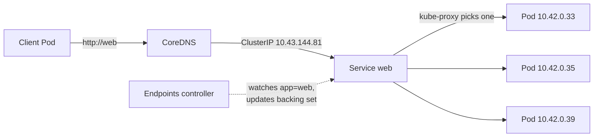

# Services

> A stable address and automatic load balancing in front of a set of Pods whose
> individual IPs keep changing.

**Before this:** [Deployments](04-deployments.md)

The Deployments lesson ended on an unsolved problem: every time a Pod is recreated
— on delete, on scale, on rollout — it comes back with a **new IP**. Anything that
wants to *talk* to those Pods cannot chase a moving target. A Service is the fixed
point in front of them: one virtual IP and one DNS name that never change, with
traffic spread across whatever Pods currently match.

---

# Part 1 — Walkthrough

Do these in order. You need the Deployment from the previous lesson running first:

```bash
kubectl apply -f playground/deployment.yaml
```

## Make each Pod identifiable

The three Pods serve the identical nginx page, so load balancing would be
invisible. Give each one a page that names itself:

```bash
for p in $(kubectl get pods -l app=web -o name); do
  kubectl exec "$p" -- sh -c "echo 'hello from ${p#pod/}' > /usr/share/nginx/html/index.html"
done
```

```
seeded web-f947f66df-cwhd2
seeded web-f947f66df-fqf9l
seeded web-f947f66df-r2nhc
```

## Create the Service

The manifest is [`playground/service.yaml`](../playground/service.yaml). The key
line is `selector: app=web` — the Service adopts every Pod carrying that label.

```bash
kubectl apply -f playground/service.yaml
```

```
service/web created
```

```bash
kubectl get svc web
```

```
NAME   TYPE        CLUSTER-IP     EXTERNAL-IP   PORT(S)   AGE
web    ClusterIP   10.43.144.81   <none>        80/TCP    0s
```

That `CLUSTER-IP` (`10.43.144.81`) is the stable address. Now look at what sits
behind it:

```bash
kubectl get endpoints web
```

```
NAME   ENDPOINTS                                   AGE
web    10.42.0.33:80,10.42.0.34:80,10.42.0.35:80   0s
```

The three backing Pod IPs. **You never typed these** — the Service found them
through the `app=web` label. Endpoints are computed from the selector, not
maintained by hand.

> `kubectl` prints a deprecation note here: `v1 Endpoints is deprecated in v1.33+;
> use discovery.k8s.io/v1 EndpointSlice`. Same information; `kubectl get
> endpointslices` is the modern view. Endpoints still works and reads more simply.

## Prove it load-balances

Hit the Service by its DNS name from a throwaway Pod, twelve times, and count
where the requests land:

```bash
kubectl run curl --image=curlimages/curl:8.11.1 --restart=Never --rm -i --command -- \
  sh -c 'for i in 1 2 3 4 5 6 7 8 9 10 11 12; do curl -s http://web; done | sort | uniq -c'
```

```
      2 hello from web-f947f66df-cwhd2
      4 hello from web-f947f66df-fqf9l
      6 hello from web-f947f66df-r2nhc
```

Two things just happened. First, `http://web` **resolved** — the cluster's
built-in DNS turned the Service name into its ClusterIP. Second, the twelve
requests were **spread across all three Pods**. One name in, load-balanced across
the whole set.

## The payoff: kill a Pod, the address does not move

This is the problem from the Deployments lesson, finally solved. Note the current
Service IP, then delete a backing Pod:

```bash
kubectl get endpoints web        # before
kubectl delete pod web-f947f66df-96hh2
```

Wait a few seconds, then look again:

```bash
kubectl get svc web
kubectl get endpoints web
```

```
NAME   TYPE        CLUSTER-IP     EXTERNAL-IP   PORT(S)   AGE
web    ClusterIP   10.43.144.81   <none>        80/TCP    82s

NAME   ENDPOINTS                                   AGE
web    10.42.0.33:80,10.42.0.35:80,10.42.0.39:80   82s
```

The `CLUSTER-IP` is **unchanged** (`10.43.144.81`). The endpoint list, though, has
**updated itself**: the deleted Pod's `10.42.0.34` is gone and the replacement's
`10.42.0.39` has taken its place — no command run to make that happen. Pods churn
underneath; the address in front holds still. That is the entire point of a
Service.

## Reach it from outside the cluster: NodePort

So far `web` only works *inside* the cluster (you called it from a Pod). To reach
it from your host, change the Service **type** to `NodePort`. The manifest
[`playground/service-nodeport.yaml`](../playground/service-nodeport.yaml) is the
same Service with `type: NodePort` and a chosen `nodePort: 30080`:

```bash
kubectl apply -f playground/service-nodeport.yaml
kubectl get svc web
```

```
NAME   TYPE       CLUSTER-IP     EXTERNAL-IP   PORT(S)        AGE
web    NodePort   10.43.144.81   <none>        80:30080/TCP   3m24s
```

```bash
curl http://localhost:30080
```

```
hello from web-f947f66df-r2nhc
```

`PORT(S)` now reads `80:30080/TCP` — the cluster opened port **30080 on every
node**, forwarding it to the Service. A `NodePort` is still a `ClusterIP`
underneath (note the ClusterIP is unchanged); it just adds the external door.

## Clean up

```bash
kubectl delete -f playground/service.yaml
kubectl delete -f playground/deployment.yaml
```

---

# Part 2 — How it works

## A Service is a stable name, not a process

There is no server called "the Service." A Service is a record in the API that
says "traffic for this virtual IP and this name should go to Pods matching this
selector." Two cluster components make that record real:

- **CoreDNS** resolves the name `web` (and `web.default.svc.cluster.local`) to the
  Service's ClusterIP. This is why `http://web` worked from another Pod.
- **kube-proxy** on each node programs the kernel (iptables/IPVS) so packets aimed
  at the ClusterIP get rewritten to one of the current backing Pod IPs, chosen per
  connection. This is the load balancing — it happens in the kernel, with no proxy
  process in the request path.

## The selector → Endpoints loop

The Service's `selector` is not a one-time query. A controller watches Pods
continuously and keeps an **Endpoints** (EndpointSlice) object in sync: a Pod that
starts matching is added, one that dies or stops matching is removed. That loop is
why the endpoint list rewrote itself the instant you deleted a Pod. The Service
object never changed — only its computed backing set did.



## The three types you will actually use

| Type | Reachable from | How | Use for |
| --- | --- | --- | --- |
| `ClusterIP` (default) | inside the cluster only | virtual IP + DNS name | service-to-service traffic |
| `NodePort` | outside, via `<any-node-ip>:<port>` | opens one high port (30000–32767) on every node | quick external access, dev, or a base for LBs |
| `LoadBalancer` | outside, via one external IP | asks the cloud/provider for a real load balancer in front of the NodePort | production external entry (cloud) |

Each type is a superset of the one above: a `NodePort` is a `ClusterIP` plus a
node port; a `LoadBalancer` is a `NodePort` plus an external IP. On a bare k3s
cluster, `LoadBalancer` is served by the bundled ServiceLB.

## port vs targetPort vs nodePort

Three port numbers, three roles — this is a common source of confusion:

- **`port`** — the port the Service listens on (what clients hit: `web:80`).
- **`targetPort`** — the port on the **Pod** to forward to (the containerPort, `80`).
- **`nodePort`** — only for `NodePort`/`LoadBalancer`: the port opened on every
  node (`30080`).

## What Services do not do

A Service load-balances at **L4 (TCP/UDP)** by connection. It does not route by
URL path or hostname, terminate TLS, or do HTTP-aware routing — that is what an
**Ingress** (or Gateway) adds on top, usually in front of several ClusterIP
Services. Services are the plumbing; Ingress is the front door.

---

# Part 3 — Command reference

### Create and inspect

```bash
kubectl apply -f playground/service.yaml   # create/update from manifest
kubectl get svc                            # list Services (TYPE, CLUSTER-IP, PORTS)
kubectl get svc web -o wide                # + selector column
kubectl get endpoints web                  # the Pod IPs currently behind it
kubectl get endpointslices -l kubernetes.io/service-name=web   # modern view
kubectl describe svc web                   # selector, ports, endpoints, events
```

### Create imperatively (quick experiments)

```bash
kubectl expose deployment web --port=80 --target-port=80          # ClusterIP
kubectl expose deployment web --port=80 --type=NodePort           # NodePort
# for real work, prefer a manifest under version control
```

### Test connectivity

```bash
# from inside the cluster (DNS name works):
kubectl run curl --image=curlimages/curl:8.11.1 --restart=Never --rm -i \
  --command -- sh -c 'curl -s http://web'

# fully-qualified name:
#   web.default.svc.cluster.local

# from the host, once it is a NodePort:
curl http://localhost:30080
```

### Change type / ports

```bash
kubectl patch svc web -p '{"spec":{"type":"NodePort"}}'   # or edit the manifest
kubectl edit svc web                                       # open the live spec
```

### Discovering fields

```bash
kubectl explain service.spec
kubectl explain service.spec.ports
```

---

## Recap

- A Service gives a churning set of Pods **one stable ClusterIP and DNS name**;
  delete and recreate Pods all day and the address never moves.
- It finds its Pods by **label selector**, and a controller keeps the
  **Endpoints** list in sync automatically — you never maintain IPs by hand.
- **CoreDNS** resolves the name; **kube-proxy** does the per-connection load
  balancing in the kernel. There is no proxy process in the request path.
- Types stack: **ClusterIP** (internal) ⊂ **NodePort** (adds a node port) ⊂
  **LoadBalancer** (adds an external IP).
- Services are **L4**. URL/host routing and TLS termination belong to **Ingress**,
  which sits in front of Services — the next topic.

---

**Next:** [Ingress](06-ingress.md) — one external entry point routing by hostname
and path to several Services.

[Contents](../README.md) · [Object reference](objects.md) ·
[Troubleshooting](troubleshooting.md)
