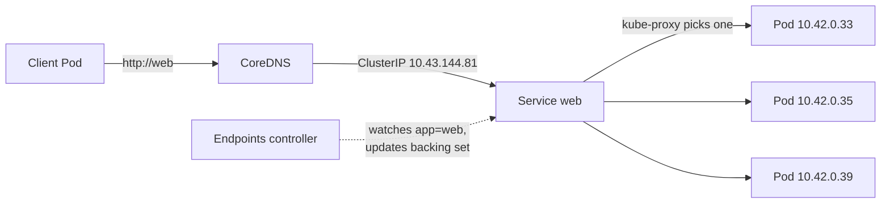

[English](05-services.md) · **中文**

# Service

> 在一組個別 IP 一直變動的 Pod 前面,提供固定地址與自動負載平衡。

**前一課:** [Deployment](04-deployments.zh.md)

Deployment 那一課結束在一個沒解的問題:每次 Pod 被重建 —— 刪除、擴縮、rollout —— 它都
帶著**新 IP** 回來。任何想*連到*這些 Pod 的東西,都不能追著一個移動的目標跑。Service
就是它們前面那個固定的點:一個永遠不變的虛擬 IP 和一個 DNS 名字,流量分散到當下符合的
那些 Pod。

---

# Part 1 — 操作走一遍

依序做。你需要先讓上一課的 Deployment 跑著:

```bash
kubectl apply -f playground/deployment.yaml
```

## 讓每個 Pod 能被辨識

三個 Pod 提供一模一樣的 nginx 頁面,所以看不出負載平衡。讓每個回傳一個報自己名字的頁面:

```bash
for p in $(kubectl get pods -l app=web -o name); do
  kubectl exec "$p" -- sh -c "echo 'hello from ${p#pod/}' > /usr/share/nginx/html/index.html"
done
```

```
seeded web-f947f66df-cwhd2
seeded web-f947f66df-fqf9l
seeded web-f947f66df-r2nhc
```

## 建立 Service

manifest 是 [`playground/service.yaml`](../playground/service.yaml)。關鍵那行是
`selector: app=web` —— Service 會認養每個帶著那個標籤的 Pod。

```bash
kubectl apply -f playground/service.yaml
```

```
service/web created
```

```bash
kubectl get svc web
```

```
NAME   TYPE        CLUSTER-IP     EXTERNAL-IP   PORT(S)   AGE
web    ClusterIP   10.43.144.81   <none>        80/TCP    0s
```

那個 `CLUSTER-IP`(`10.43.144.81`)就是固定地址。現在看它背後坐著什麼:

```bash
kubectl get endpoints web
```

```
NAME   ENDPOINTS                                   AGE
web    10.42.0.33:80,10.42.0.34:80,10.42.0.35:80   0s
```

三個支撐它的 Pod IP。**你從沒打過這些** —— Service 透過 `app=web` 標籤找到它們。
Endpoints 是從 selector 算出來的,不是手動維護的。

> `kubectl` 在這裡會印一則棄用提示:`v1 Endpoints is deprecated in v1.33+; use
> discovery.k8s.io/v1 EndpointSlice`。同樣的資訊;`kubectl get endpointslices` 是新式
> 檢視。Endpoints 仍能用,而且讀起來比較簡單。

## 驗證它會負載平衡

從一個丟過即棄的 Pod,用 DNS 名字打這個 Service 十二次,統計請求落在哪:

```bash
kubectl run curl --image=curlimages/curl:8.11.1 --restart=Never --rm -i --command -- \
  sh -c 'for i in 1 2 3 4 5 6 7 8 9 10 11 12; do curl -s http://web; done | sort | uniq -c'
```

```
      2 hello from web-f947f66df-cwhd2
      4 hello from web-f947f66df-fqf9l
      6 hello from web-f947f66df-r2nhc
```

剛剛發生了兩件事。第一,`http://web` **被解析了** —— 叢集內建的 DNS 把 Service 名字變成
它的 ClusterIP。第二,這十二個請求被**分散到全部三個 Pod**。一個名字進來,被負載平衡到
整組。

## 重頭戲:砍掉一個 Pod,地址不動

這就是 Deployment 那一課的問題,終於解決了。記下目前的 Service IP,然後刪掉一個支撐它的
Pod:

```bash
kubectl get endpoints web        # 之前
kubectl delete pod web-f947f66df-96hh2
```

等幾秒,再看一次:

```bash
kubectl get svc web
kubectl get endpoints web
```

```
NAME   TYPE        CLUSTER-IP     EXTERNAL-IP   PORT(S)   AGE
web    ClusterIP   10.43.144.81   <none>        80/TCP    82s

NAME   ENDPOINTS                                   AGE
web    10.42.0.33:80,10.42.0.35:80,10.42.0.39:80   82s
```

`CLUSTER-IP` **沒變**(`10.43.144.81`)。但 endpoint 名單**自己更新了**:被刪掉那個 Pod
的 `10.42.0.34` 不見了,替補的 `10.42.0.39` 頂上 —— 沒有下任何指令去讓這件事發生。Pod
在底下不斷變動;前面的地址巍然不動。這就是 Service 的全部重點。

## 從叢集外連進來:NodePort

到目前為止 `web` 只在叢集*裡面*有效(你是從一個 Pod 打的)。想從你的主機連到它,把
Service 的**型別**改成 `NodePort`。manifest
[`playground/service-nodeport.yaml`](../playground/service-nodeport.yaml) 就是同一個
Service,加上 `type: NodePort` 和選定的 `nodePort: 30080`:

```bash
kubectl apply -f playground/service-nodeport.yaml
kubectl get svc web
```

```
NAME   TYPE       CLUSTER-IP     EXTERNAL-IP   PORT(S)        AGE
web    NodePort   10.43.144.81   <none>        80:30080/TCP   3m24s
```

```bash
curl http://localhost:30080
```

```
hello from web-f947f66df-r2nhc
```

`PORT(S)` 現在顯示 `80:30080/TCP` —— 叢集在**每個節點**上開了 **30080** 這個埠,轉發給
Service。`NodePort` 底下仍然是一個 `ClusterIP`(注意 ClusterIP 沒變);它只是多加了一道
對外的門。

## 清理

```bash
kubectl delete -f playground/service.yaml
kubectl delete -f playground/deployment.yaml
```

---

# Part 2 — 原理說明

## Service 是一個固定名字,不是一個行程

沒有一個叫「the Service」的伺服器。Service 是 API 裡的一筆記錄,說「打向這個虛擬 IP 和
這個名字的流量,應該送去符合這個 selector 的 Pod」。兩個叢集元件讓這筆記錄成真:

- **CoreDNS** 把名字 `web`(和 `web.default.svc.cluster.local`)解析成 Service 的
  ClusterIP。這就是為什麼從另一個 Pod 打 `http://web` 會通。
- 每個節點上的 **kube-proxy** 對核心(iptables/IPVS)寫規則,讓打向 ClusterIP 的封包被
  改寫成當下某個支撐 Pod 的 IP,逐連線選擇。這就是負載平衡 —— 發生在核心裡,請求路徑上
  沒有代理行程。

## selector → Endpoints 迴圈

Service 的 `selector` 不是一次性查詢。一個控制器持續盯著 Pod,讓一個 **Endpoints**
(EndpointSlice)物件保持同步:開始符合的 Pod 被加進來,死掉或不再符合的被移除。就是這個
迴圈,讓 endpoint 名單在你刪 Pod 的瞬間自己改寫。Service 物件從沒改變 —— 改變的只有它
算出來的支撐集合。



## 你真正會用到的三種型別

| 型別 | 誰連得到 | 怎麼做 | 用於 |
| --- | --- | --- | --- |
| `ClusterIP`(預設) | 只有叢集內部 | 虛擬 IP + DNS 名字 | 服務對服務的流量 |
| `NodePort` | 叢集外,經 `<任一節點-ip>:<port>` | 在每個節點開一個高位埠(30000–32767) | 快速對外、開發、或當 LB 的基底 |
| `LoadBalancer` | 叢集外,經一個對外 IP | 向雲端/供應商要一個真正的負載平衡器擋在 NodePort 前 | 正式環境對外入口(雲) |

每個型別都是上一個的超集:`NodePort` 是 `ClusterIP` 加一個 node port;`LoadBalancer`
是 `NodePort` 加一個對外 IP。在裸的 k3s 叢集上,`LoadBalancer` 由內建的 ServiceLB 提供。

## port vs targetPort vs nodePort

三個 port 數字、三種角色 —— 這是常見的混淆來源:

- **`port`** —— Service 監聽的 port(client 打的:`web:80`)。
- **`targetPort`** —— 要轉發到的 **Pod** 上的 port(containerPort,`80`)。
- **`nodePort`** —— 只有 `NodePort`/`LoadBalancer` 才有:在每個節點開的 port(`30080`)。

## Service 不做什麼

Service 在 **L4(TCP/UDP)** 逐連線做負載平衡。它不依 URL 路徑或主機名路由、不終結 TLS、
不做懂 HTTP 的路由 —— 那是 **Ingress**(或 Gateway)加在上面的,通常擋在好幾個 ClusterIP
Service 前面。Service 是水管;Ingress 是大門。

---

# Part 3 — 指令參考

### 建立與檢視

```bash
kubectl apply -f playground/service.yaml   # 從 manifest 建立/更新
kubectl get svc                            # 列出 Service(TYPE、CLUSTER-IP、PORTS)
kubectl get svc web -o wide                # + selector 欄
kubectl get endpoints web                  # 目前坐在它後面的 Pod IP
kubectl get endpointslices -l kubernetes.io/service-name=web   # 新式檢視
kubectl describe svc web                   # selector、ports、endpoints、events
```

### 命令式建立(快速實驗)

```bash
kubectl expose deployment web --port=80 --target-port=80          # ClusterIP
kubectl expose deployment web --port=80 --type=NodePort           # NodePort
# 正式工作請優先用版本控制裡的 manifest
```

### 測試連通性

```bash
# 從叢集內部(DNS 名字有效):
kubectl run curl --image=curlimages/curl:8.11.1 --restart=Never --rm -i \
  --command -- sh -c 'curl -s http://web'

# 完整網域名:
#   web.default.svc.cluster.local

# 從主機,當它是 NodePort 之後:
curl http://localhost:30080
```

### 改型別 / port

```bash
kubectl patch svc web -p '{"spec":{"type":"NodePort"}}'   # 或編輯 manifest
kubectl edit svc web                                       # 開即時 spec
```

### 探索欄位

```bash
kubectl explain service.spec
kubectl explain service.spec.ports
```

---

## 重點回顧

- Service 給一組不斷變動的 Pod **一個固定的 ClusterIP 和 DNS 名字**;整天刪除、重建 Pod,
  地址都不會移動。
- 它靠**標籤 selector** 找到它的 Pod,一個控制器自動讓 **Endpoints** 名單保持同步 ——
  你從不手動維護 IP。
- **CoreDNS** 解析名字;**kube-proxy** 在核心裡做逐連線的負載平衡。請求路徑上沒有代理
  行程。
- 型別層層堆疊:**ClusterIP**(內部)⊂ **NodePort**(加一個 node port)⊂
  **LoadBalancer**(加一個對外 IP)。
- Service 是 **L4**。URL/host 路由與 TLS 終結屬於 **Ingress**,它擋在 Service 前面 ——
  就是下一個主題。

---

**下一課:** [Ingress](06-ingress.zh.md) —— 一個對外入口,依主機名與路徑路由到多個
Service。

[目錄](../README.md) · [物件參考](objects.zh.md) ·
[疑難排解](troubleshooting.zh.md)
