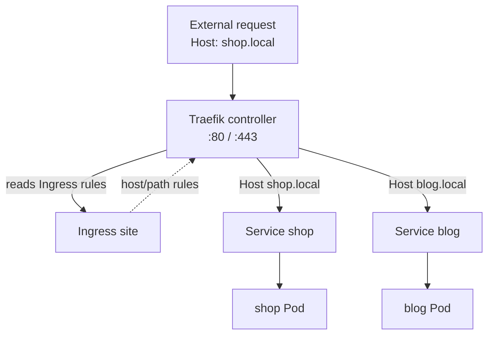

# Ingress

> One external entry point (ports 80/443) that routes HTTP by hostname and path to
> several Services, and terminates TLS.

**Before this:** [Services](05-services.md)

A Service can expose a set of Pods, but a `NodePort` gives you an ugly high port
(30080…), one per Service, no URL-based routing, and no TLS. Ingress is the layer
that fixes all three: the whole cluster exposes **one** entry on 80/443, and an
Ingress resource says "requests for *this host / this path* go to *that Service*."
It routes at **L7** — it reads the HTTP request — where a Service only sees L4.

An Ingress resource is just **rules**. Something has to enforce them: an **Ingress
Controller**. k3s bundles **Traefik** as the controller (it already runs in
`kube-system`, holding ports 80/443), so these steps work out of the box.

---

# Part 1 — Walkthrough

Do these in order.

## Deploy two backends

[`playground/ingress-apps.yaml`](../playground/ingress-apps.yaml) defines two apps,
`shop` and `blog`, each a Deployment plus a **ClusterIP** Service. They are
internal only — Ingress will be the way in.

```bash
kubectl apply -f playground/ingress-apps.yaml
```

```
deployment.apps/shop created
service/shop created
deployment.apps/blog created
service/blog created
```

```bash
kubectl get svc
```

```
NAME         TYPE        CLUSTER-IP     EXTERNAL-IP   PORT(S)   AGE
blog         ClusterIP   10.43.8.28     <none>        80/TCP    8s
kubernetes   ClusterIP   10.43.0.1      <none>        443/TCP   23h
shop         ClusterIP   10.43.18.137   <none>        80/TCP    8s
```

Both `ClusterIP`, both `<none>` external — you cannot reach either from outside yet.

## Make each backend identifiable

```bash
kubectl exec deploy/shop -- sh -c "echo 'hello from SHOP' > /usr/share/nginx/html/index.html"
kubectl exec deploy/blog -- sh -c "echo 'hello from BLOG' > /usr/share/nginx/html/index.html"
```

## Create the Ingress

[`playground/ingress.yaml`](../playground/ingress.yaml) routes by host: `shop.local`
→ the `shop` Service, `blog.local` → the `blog` Service.

```bash
kubectl apply -f playground/ingress.yaml
```

```
ingress.networking.k8s.io/site created
```

```bash
kubectl get ingress
```

```
NAME   CLASS     HOSTS                   ADDRESS         PORTS   AGE
site   traefik   shop.local,blog.local   172.29.223.79   80      6s
```

`CLASS traefik` confirms which controller picked it up. Check that the rules
actually resolved to Pods:

```bash
kubectl describe ingress site
```

```
Rules:
  Host        Path  Backends
  ----        ----  --------
  shop.local
              /   shop:80 (10.42.0.44:80)
  blog.local
              /   blog:80 (10.42.0.45:80)
```

Each host maps to a Service, and the Service has already resolved to a backing Pod
IP — the full chain **Ingress → Service → Pod** is wired.

## One entry, routed by host

Send every request to the **same** address (`localhost`, which is Traefik on port
80) and only change the `Host` header:

```bash
curl -s -H 'Host: shop.local'    http://localhost
curl -s -H 'Host: blog.local'    http://localhost
curl -s -H 'Host: unknown.local' http://localhost
```

```
hello from SHOP
hello from BLOG
404 page not found
```

Same IP, same port — the hostname alone decided the backend. An unmatched host
falls through to a 404. That is L7 routing.

> **Why the `-H 'Host:'` header instead of `curl http://shop.local`?** `shop.local`
> is not in your machine's DNS or hosts file, so the name would not resolve. The
> header fakes the hostname the request claims to be for; Traefik routes purely on
> that header, so the result is identical. In production you would point real DNS
> records at the Ingress address instead.

## Clean up

```bash
kubectl delete -f playground/ingress.yaml -f playground/ingress-apps.yaml
```

---

# Part 2 — How it works

## Resource vs controller

The split is the key idea. The **Ingress resource** is a passive list of routing
rules stored in the API — on its own it does nothing. The **Ingress Controller**
is a running Pod (here Traefik) that watches every Ingress resource and
reconfigures itself to serve those rules, sitting on 80/443 as the actual reverse
proxy. No controller installed = an Ingress that resolves to nothing. Different
clusters ship different controllers (Traefik, ingress-nginx, cloud ones); the
resource is portable, the controller is the engine.



## It sits in front of Services, not instead of them

Ingress does not replace Services — it stacks on top:

```
external → Ingress (L7: host/path routing, TLS termination)
             → Service (L4: stable ClusterIP, load balancing)
               → Pods
```

Every backend still needs its own ClusterIP Service (you created `shop` and `blog`).
Ingress only adds the shared front door and the HTTP-aware routing. Load balancing
across a Service's Pods is still the Service's job.

## Routing by host vs by path

Two ways to split traffic:

| Style | Example | Rule field |
| --- | --- | --- |
| By host | `shop.example.com`, `blog.example.com` | `rules[].host` |
| By path | `example.com/shop`, `example.com/blog` | `rules[].http.paths[].path` |

**A path caveat:** by default Traefik forwards the matched path **unchanged** — a
request to `/shop` reaches the backend as `/shop`, not `/`. So the backend must
either understand `/shop` itself or you add a path-rewrite (a Traefik middleware,
or the `nginx.ingress.kubernetes.io/rewrite-target` annotation on ingress-nginx).
Host routing avoids this because it forwards `/` untouched — which is why the
walkthrough uses hosts.

`pathType` controls matching: `Prefix` (match by path segments, the common choice)
or `Exact` (the whole path must match).

## TLS terminates here

Ingress is where HTTPS is handled. You reference a `Secret` holding a certificate
and key, and the controller terminates TLS at the edge; traffic to the backend
Services stays plain HTTP inside the cluster. One place to manage certificates,
and no backend has to know about TLS:

```yaml
spec:
  tls:
    - hosts: [shop.local]
      secretName: shop-tls        # a kubernetes.io/tls Secret
  rules:
    - host: shop.local
      ...
```

## Where Ingress stops

Ingress is HTTP/HTTPS only and its spec is deliberately small — anything richer
(traffic splitting, header-based routing, non-HTTP protocols) has historically
needed controller-specific annotations. The **Gateway API** is the newer, more
expressive successor being standardized to replace it; Ingress remains the common,
well-understood default.

---

# Part 3 — Command reference

### Create and inspect

```bash
kubectl apply -f playground/ingress.yaml
kubectl get ingress                     # CLASS, HOSTS, ADDRESS, PORTS
kubectl describe ingress site           # rules + resolved backend Pod IPs + events
kubectl get ingressclass                # which controllers are available
```

### Confirm the controller

```bash
kubectl get pods -n kube-system | grep traefik     # k3s's bundled controller
kubectl get svc  -n kube-system traefik            # the LoadBalancer on 80/443
```

### Test routing

```bash
# route by faking the Host header (no DNS needed):
curl -s -H 'Host: shop.local' http://localhost

# once real DNS points at the Ingress address:
curl https://shop.example.com
```

### Discovering fields

```bash
kubectl explain ingress.spec.rules
kubectl explain ingress.spec.tls
```

---

## Recap

- Ingress is **one entry on 80/443** that routes HTTP by **host and path** to
  several Services, and **terminates TLS** — all at L7.
- An Ingress **resource** is just rules; an Ingress **Controller** (k3s bundles
  **Traefik**) is the running proxy that enforces them. No controller, no routing.
- It **sits in front of** Services, it does not replace them — each backend still
  needs its ClusterIP Service.
- Host routing forwards `/` untouched; **path routing forwards the prefix
  unchanged**, so it usually needs a rewrite.
- TLS is configured once on the Ingress via a `Secret`; backends stay plain HTTP.

---

**Next:** [ConfigMaps & Secrets](07-config.md) — feeding configuration and
credentials into Pods without baking them into the image.

[Contents](../README.md) · [Object reference](objects.md) ·
[Troubleshooting](troubleshooting.md)
