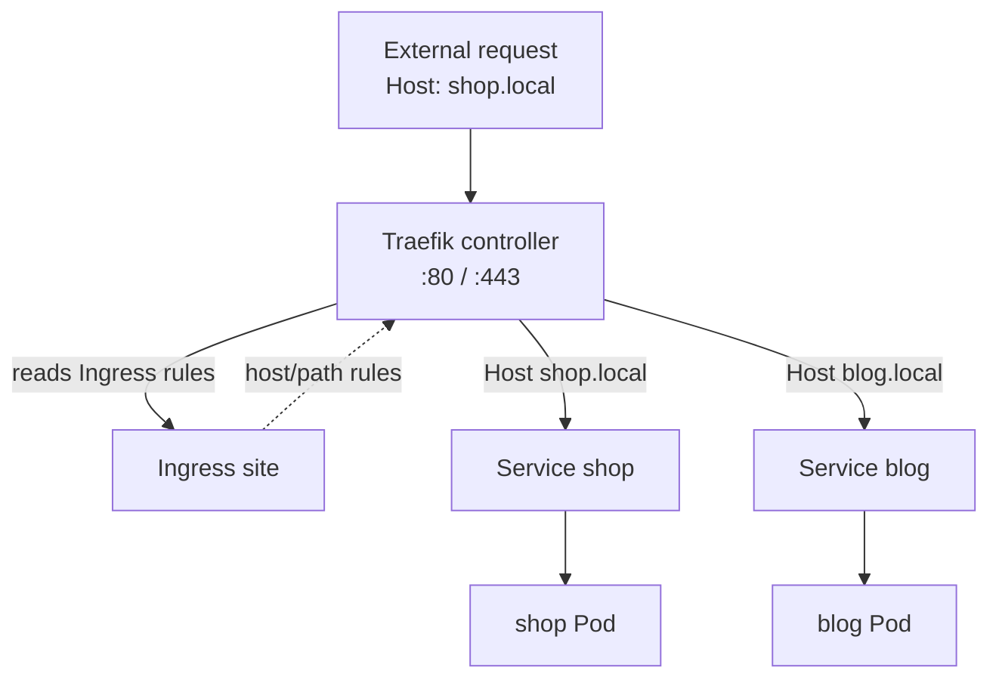

[English](06-ingress.md) · **中文**

# Ingress

> 一個對外入口(80/443 埠),依主機名與路徑把 HTTP 路由到多個 Service,並終結 TLS。

**前一課:** [Service](05-services.zh.md)

Service 能把一組 Pod 對外開放,但 `NodePort` 給你的是一個醜醜的高位埠(30080…)、一個
Service 佔一個、沒有以 URL 為基礎的路由、也沒有 TLS。Ingress 就是把這三點都補上的一層:
整個叢集只在 80/443 開**一個**入口,而一個 Ingress 資源說「打到*這個 host / 這個 path*
的請求,送去*那個 Service*」。它在 **L7** 路由 —— 它讀 HTTP 請求 —— 而 Service 只看到 L4。

一個 Ingress 資源只是**規則**。要有東西去執行它們:一個 **Ingress Controller**。k3s 內建
**Traefik** 當 controller(它已經在 `kube-system` 裡跑著,佔住 80/443 埠),所以這些步驟
開箱即用。

---

# Part 1 — 操作走一遍

依序做。

## 部署兩個後端

[`playground/ingress-apps.yaml`](../playground/ingress-apps.yaml) 定義了兩個 app,`shop`
和 `blog`,各自一個 Deployment 加一個 **ClusterIP** Service。它們只對內 —— Ingress 才是
進來的路。

```bash
kubectl apply -f playground/ingress-apps.yaml
```

```
deployment.apps/shop created
service/shop created
deployment.apps/blog created
service/blog created
```

```bash
kubectl get svc
```

```
NAME         TYPE        CLUSTER-IP     EXTERNAL-IP   PORT(S)   AGE
blog         ClusterIP   10.43.8.28     <none>        80/TCP    8s
kubernetes   ClusterIP   10.43.0.1      <none>        443/TCP   23h
shop         ClusterIP   10.43.18.137   <none>        80/TCP    8s
```

兩個都是 `ClusterIP`、對外都是 `<none>` —— 你還沒辦法從外面連到任何一個。

## 讓每個後端能被辨識

```bash
kubectl exec deploy/shop -- sh -c "echo 'hello from SHOP' > /usr/share/nginx/html/index.html"
kubectl exec deploy/blog -- sh -c "echo 'hello from BLOG' > /usr/share/nginx/html/index.html"
```

## 建立 Ingress

[`playground/ingress.yaml`](../playground/ingress.yaml) 依 host 路由:`shop.local` →
`shop` Service,`blog.local` → `blog` Service。

```bash
kubectl apply -f playground/ingress.yaml
```

```
ingress.networking.k8s.io/site created
```

```bash
kubectl get ingress
```

```
NAME   CLASS     HOSTS                   ADDRESS         PORTS   AGE
site   traefik   shop.local,blog.local   172.29.223.79   80      6s
```

`CLASS traefik` 確認了是哪個 controller 接手它。檢查規則是否真的解析到了 Pod:

```bash
kubectl describe ingress site
```

```
Rules:
  Host        Path  Backends
  ----        ----  --------
  shop.local
              /   shop:80 (10.42.0.44:80)
  blog.local
              /   blog:80 (10.42.0.45:80)
```

每個 host 對應到一個 Service,而 Service 已經解析到一個支撐的 Pod IP —— 完整的鏈
**Ingress → Service → Pod** 都接上了。

## 一個入口,依 host 路由

把每個請求都送到**同一個**位址(`localhost`,也就是 80 埠上的 Traefik),只換 `Host`
標頭:

```bash
curl -s -H 'Host: shop.local'    http://localhost
curl -s -H 'Host: blog.local'    http://localhost
curl -s -H 'Host: unknown.local' http://localhost
```

```
hello from SHOP
hello from BLOG
404 page not found
```

同一個 IP、同一個埠 —— 光是主機名就決定了後端。沒對到的 host 落到 404。這就是 L7 路由。

> **為什麼用 `-H 'Host:'` 標頭而不是 `curl http://shop.local`?** `shop.local` 不在你
> 電腦的 DNS 或 hosts 檔裡,所以名字無法解析。這個標頭偽裝出請求聲稱要去的主機名;
> Traefik 純粹依這個標頭路由,所以結果一模一樣。正式環境你會改成把真實的 DNS 記錄指向
> Ingress 位址。

## 清理

```bash
kubectl delete -f playground/ingress.yaml -f playground/ingress-apps.yaml
```

---

# Part 2 — 原理說明

## 資源 vs 控制器

這個切分是關鍵想法。**Ingress 資源**是存在 API 裡的一份被動的路由規則清單 —— 它自己
什麼都不做。**Ingress Controller** 是一個在跑的 Pod(這裡是 Traefik),它盯著每個 Ingress
資源、重新設定自己去服務那些規則,坐在 80/443 上當真正的反向代理。沒裝 controller = 一個
解析不到任何東西的 Ingress。不同叢集裝不同 controller(Traefik、ingress-nginx、雲端的);
資源是可攜的,controller 才是引擎。



## 它站在 Service 前面,不是取代它們

Ingress 不取代 Service —— 它疊在上面:

```
external → Ingress (L7: host/path routing, TLS termination)
             → Service (L4: stable ClusterIP, load balancing)
               → Pods
```

每個後端還是需要自己的 ClusterIP Service(你建了 `shop` 和 `blog`)。Ingress 只是加上
共用的前門和懂 HTTP 的路由。在一個 Service 的 Pod 之間做負載平衡,仍然是 Service 的工作。

## 依 host vs 依 path 路由

分流的兩種方式:

| 方式 | 例子 | 規則欄位 |
| --- | --- | --- |
| 依 host | `shop.example.com`、`blog.example.com` | `rules[].host` |
| 依 path | `example.com/shop`、`example.com/blog` | `rules[].http.paths[].path` |

**一個 path 的雷:** 預設 Traefik 會**原封不動**轉發對到的路徑 —— 打到 `/shop` 的請求
會以 `/shop` 到達後端,不是 `/`。所以後端要嘛自己認得 `/shop`,要嘛你加一條 path-rewrite
(一個 Traefik middleware,或 ingress-nginx 上的
`nginx.ingress.kubernetes.io/rewrite-target` annotation)。host 路由避開了這件事,因為
它轉發的是原封不動的 `/` —— 這就是這個 walkthrough 用 host 的原因。

`pathType` 控制比對:`Prefix`(依路徑分段比對,常見選擇)或 `Exact`(整個路徑必須相符)。

## TLS 在這裡終結

Ingress 是處理 HTTPS 的地方。你引用一個裝著憑證與金鑰的 `Secret`,controller 就在邊緣
終結 TLS;送去後端 Service 的流量在叢集內維持純 HTTP。憑證集中在一處管理,而且沒有一個
後端需要知道 TLS 的事:

```yaml
spec:
  tls:
    - hosts: [shop.local]
      secretName: shop-tls        # 一個 kubernetes.io/tls Secret
  rules:
    - host: shop.local
      ...
```

## Ingress 的界線

Ingress 只管 HTTP/HTTPS,而且它的 spec 刻意做得很小 —— 任何更豐富的東西(流量切分、
依標頭路由、非 HTTP 協定)過去都需要特定 controller 的 annotation。**Gateway API** 是
更新、更有表達力的後繼者,正在被標準化來取代它;而 Ingress 仍是常見、大家都懂的預設選項。

---

# Part 3 — 指令參考

### 建立與檢視

```bash
kubectl apply -f playground/ingress.yaml
kubectl get ingress                     # CLASS、HOSTS、ADDRESS、PORTS
kubectl describe ingress site           # 規則 + 解析出的後端 Pod IP + events
kubectl get ingressclass                # 有哪些 controller 可用
```

### 確認 controller

```bash
kubectl get pods -n kube-system | grep traefik     # k3s 內建的 controller
kubectl get svc  -n kube-system traefik            # 80/443 上的 LoadBalancer
```

### 測試路由

```bash
# 用偽裝的 Host 標頭來路由(不需要 DNS):
curl -s -H 'Host: shop.local' http://localhost

# 當真實 DNS 指向 Ingress 位址之後:
curl https://shop.example.com
```

### 探索欄位

```bash
kubectl explain ingress.spec.rules
kubectl explain ingress.spec.tls
```

---

## 重點回顧

- Ingress 是 **80/443 上的一個入口**,依 **host 和 path** 把 HTTP 路由到多個 Service,
  並**終結 TLS** —— 全都在 L7。
- 一個 Ingress **資源**只是規則;一個 Ingress **Controller**(k3s 內建 **Traefik**)才是
  執行它們、在跑的代理。沒 controller,就沒路由。
- 它**站在 Service 前面**,不取代它們 —— 每個後端還是需要自己的 ClusterIP Service。
- host 路由轉發原封不動的 `/`;**path 路由原封不動轉發前綴**,所以通常需要一條 rewrite。
- TLS 在 Ingress 上透過一個 `Secret` 設定一次;後端維持純 HTTP。

---

**下一課:** [ConfigMap & Secret](07-config.zh.md) —— 把設定和憑證餵進 Pod,而不用把它們
烤進 image。

[目錄](../README.md) · [物件參考](objects.zh.md) ·
[疑難排解](troubleshooting.zh.md)
