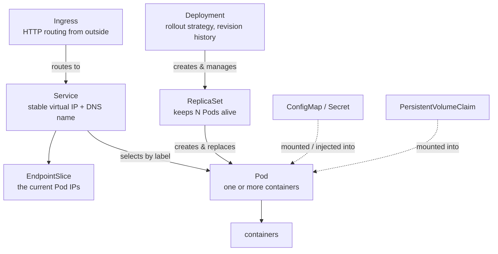

# Object Reference

> A map of the object types, what each is for, and how they own each other.
> Reference page — look things up, do not read start to finish.

---

## The ownership chain

Higher-level objects create lower-level ones. This is the chain behind almost
every workload:



You write the **Deployment**; everything below it is created for you. You delete a
Pod and the ReplicaSet makes another. You delete the Deployment and the whole
chain goes.

---

## Workloads — things that run your code

| Object | What it is for |
| --- | --- |
| **Pod** | The smallest schedulable unit. One or more containers sharing an IP, volumes, and fate. You rarely create one directly. → [Lesson](03-pods.md) |
| **ReplicaSet** | Keeps exactly *N* copies of a Pod running. Managed by a Deployment; you rarely touch it. |
| **Deployment** | Declarative updates for stateless apps: rolling updates, rollback, revision history. **The default choice for a service.** |
| **StatefulSet** | Like a Deployment, but Pods get stable names (`db-0`, `db-1`), stable storage, and ordered startup. For databases and clustered systems. |
| **DaemonSet** | Runs exactly one copy on every node (or every matching node). For log collectors, monitoring agents, CNI plugins. |
| **Job** | Runs Pods until a set number complete successfully, then stops. For batch work. |
| **CronJob** | Creates a Job on a schedule, cron syntax. |

**How to choose:** stateless service → Deployment. Needs stable identity or
storage → StatefulSet. One per node → DaemonSet. Runs to completion → Job.
Scheduled → CronJob.

---

## Networking — reaching your workloads

| Object | What it is for |
| --- | --- |
| **Service** | A stable virtual IP and DNS name in front of a changing set of Pods, selected by label. Pods come and go; the Service address does not. |
| **EndpointSlice** | The actual list of Pod IPs currently backing a Service. Maintained automatically — useful when debugging ("no endpoints" = the selector matches nothing). |
| **Ingress** | HTTP/HTTPS routing from outside the cluster: hostnames, paths, TLS. Needs an ingress controller (k3s ships Traefik). |
| **NetworkPolicy** | Firewall rules between Pods. Default is "everything can reach everything"; a policy restricts that. |

### Service types

| Type | Reachable from | Use |
| --- | --- | --- |
| `ClusterIP` *(default)* | inside the cluster only | internal service-to-service |
| `NodePort` | a fixed port on every node | quick external access, dev clusters |
| `LoadBalancer` | an external load balancer IP | production external access (cloud provisions it) |
| `ExternalName` | — | a DNS alias to something outside the cluster |

---

## Configuration — parameters and secrets

| Object | What it is for |
| --- | --- |
| **ConfigMap** | Non-sensitive key/value config. Inject as environment variables or mount as files. |
| **Secret** | The same, for sensitive values. **Base64-encoded, not encrypted** by default — enable encryption at rest and RBAC to protect it properly. |

Both can be consumed two ways: as **env vars** (read once at container start) or
as a **mounted volume** (updates propagate to the file without a restart).

---

## Storage — data that outlives a Pod

| Object | What it is for |
| --- | --- |
| **Volume** | Storage tied to the Pod's lifetime. `emptyDir` vanishes with the Pod. |
| **PersistentVolume (PV)** | A piece of real storage in the cluster. Usually created automatically. |
| **PersistentVolumeClaim (PVC)** | A *request* for storage ("10Gi, read-write-once"). Pods reference the claim, not the volume. |
| **StorageClass** | Describes a *kind* of storage and how to provision it on demand. k3s ships `local-path`. |

The normal flow: you write a **PVC**, the **StorageClass** provisions a **PV** to
satisfy it, and your Pod mounts the PVC.

---

## Organisation and identity

| Object | What it is for |
| --- | --- |
| **Namespace** | A logical partition of the cluster — separate names, separate quotas, an RBAC boundary. Not a security sandbox on its own. |
| **Labels** | Arbitrary key/value pairs on objects. **How selectors find things** — Services find Pods by label. |
| **Annotations** | Key/value metadata *not* used for selection: build info, tool configuration, controller hints. |
| **ServiceAccount** | The identity a Pod uses when it calls the Kubernetes API. |
| **Role / ClusterRole** | A set of permissions (verbs on resources). `Role` is namespaced; `ClusterRole` is cluster-wide. |
| **RoleBinding / ClusterRoleBinding** | Grants a Role to a user, group, or ServiceAccount. |
| **ResourceQuota / LimitRange** | Caps total usage in a namespace / sets default per-container limits. |

**Labels vs. annotations:** if something needs to *select* it, it is a label.
Otherwise it is an annotation.

---

## Cluster-level

| Object | What it is for |
| --- | --- |
| **Node** | A machine in the cluster. Its `status` carries capacity, conditions, and taints. |
| **Taint / Toleration** | A taint on a node repels Pods; a toleration on a Pod lets it land there anyway. |
| **CustomResourceDefinition (CRD)** | Registers a *new* object type, so operators can extend the API with their own kinds. |

---

## Namespaced or not?

Some objects live inside a namespace, some are cluster-wide. Getting this wrong
produces confusing "not found" errors.

```bash
kubectl api-resources --namespaced=true     # pods, services, deployments, ...
kubectl api-resources --namespaced=false    # nodes, namespaces, PVs, ClusterRoles, ...
```

Cluster-scoped objects ignore `-n` entirely.

---

## Every object has the same skeleton

```yaml
apiVersion: apps/v1        # API group + version
kind: Deployment           # object type
metadata:
  name: web                # identity
  namespace: default
  labels: {}               # for selection
  annotations: {}          # for metadata
spec:                      # what you want   <- you write this
  ...
status:                    # what is         <- the cluster writes this
  ...
```

Learning one object teaches you the shape of all of them. Use `kubectl explain` to
discover the fields of any of them:

```bash
kubectl explain deployment.spec.strategy
kubectl explain service.spec.type
```

---

[Contents](../README.md) · [Architecture](01-architecture.md) ·
[Troubleshooting](troubleshooting.md)
