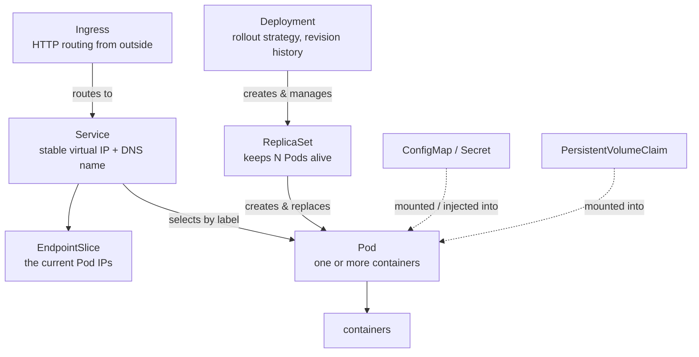

[English](objects.md) · **中文**

# 物件參考

> 一張物件類型的地圖:每個是做什麼的,以及它們怎麼互相擁有。
> 參考頁 —— 用來查東西,不是從頭讀到尾。

---

## 所有權鏈

高層物件建立低層物件。這是幾乎每個工作負載背後的那條鏈:



你寫的是 **Deployment**;它底下的一切都是幫你建的。你刪掉一個 Pod,ReplicaSet 就再造一個。
你刪掉 Deployment,整條鏈都消失。

---

## 工作負載 —— 跑你程式碼的東西

| 物件 | 用途 |
| --- | --- |
| **Pod** | 最小的可排程單位。一個或多個容器共用 IP、volume、命運。你很少直接建立它。→ [課程](03-pods.zh.md) |
| **ReplicaSet** | 維持一個 Pod 精確 *N* 份在跑。由 Deployment 管理;你很少碰它。 |
| **Deployment** | 無狀態 app 的宣告式更新:滾動更新、回滾、版本歷史。**服務的預設選擇。** |
| **StatefulSet** | 像 Deployment,但 Pod 拿到穩定名字(`db-0`、`db-1`)、穩定儲存、有序啟動。給資料庫和叢集式系統用。 |
| **DaemonSet** | 在每個節點(或每個符合的節點)上剛好跑一份。給日誌收集器、監控代理、CNI 外掛用。 |
| **Job** | 跑 Pod 直到指定數量成功完成,然後停止。給批次工作用。 |
| **CronJob** | 依排程(cron 語法)建立 Job。 |

**怎麼選:** 無狀態服務 → Deployment。需要穩定身分或儲存 → StatefulSet。每個節點一份 →
DaemonSet。跑到完成 → Job。排程 → CronJob。

---

## 網路 —— 連到你的工作負載

| 物件 | 用途 |
| --- | --- |
| **Service** | 在一組變動的 Pod(以標籤選取)前面的固定虛擬 IP 和 DNS 名字。Pod 來來去去;Service 位址不變。 |
| **EndpointSlice** | 目前支撐一個 Service 的實際 Pod IP 清單。自動維護 —— 除錯時很有用(「no endpoints」= selector 沒對到任何東西)。 |
| **Ingress** | 從叢集外的 HTTP/HTTPS 路由:主機名、路徑、TLS。需要一個 ingress controller(k3s 內建 Traefik)。 |
| **NetworkPolicy** | Pod 之間的防火牆規則。預設是「所有東西都能連到所有東西」;一條 policy 會限制它。 |

### Service 型別

| 型別 | 誰連得到 | 用途 |
| --- | --- | --- |
| `ClusterIP` *(預設)* | 只有叢集內部 | 內部服務對服務 |
| `NodePort` | 每個節點上的一個固定 port | 快速對外、開發叢集 |
| `LoadBalancer` | 一個對外的負載平衡器 IP | 正式環境對外(雲端會佈建它) |
| `ExternalName` | — | 指向叢集外某物的 DNS 別名 |

---

## 設定 —— 參數與密碼

| 物件 | 用途 |
| --- | --- |
| **ConfigMap** | 非敏感的 key/value 設定。注入成環境變數或掛成檔案。 |
| **Secret** | 一樣,但給敏感值用。預設是 **base64 編碼,不是加密** —— 啟用靜態加密和 RBAC 才能好好保護它。 |

兩者都能用兩種方式消費:當**環境變數**(容器啟動時讀一次)或當**掛載的 volume**(變更會
傳播到檔案,不用重啟)。

---

## 儲存 —— 比 Pod 活得久的資料

| 物件 | 用途 |
| --- | --- |
| **Volume** | 綁在 Pod 生命週期上的儲存。`emptyDir` 隨 Pod 消失。 |
| **PersistentVolume (PV)** | 叢集裡一塊真實的儲存。通常自動建立。 |
| **PersistentVolumeClaim (PVC)** | 對儲存的一個*請求*(「10Gi、read-write-once」)。Pod 引用的是這個 claim,不是 volume。 |
| **StorageClass** | 描述一*種*儲存,以及如何按需佈建它。k3s 內建 `local-path`。 |

正常流程:你寫一個 **PVC**,**StorageClass** 佈建一個 **PV** 來滿足它,你的 Pod 掛載這個
PVC。

---

## 組織與身分

| 物件 | 用途 |
| --- | --- |
| **Namespace** | 叢集的一個邏輯分區 —— 分開的名字、分開的配額、一個 RBAC 邊界。它本身不是安全沙箱。 |
| **Labels** | 物件上任意的 key/value 配對。**selector 靠它找東西** —— Service 靠標籤找 Pod。 |
| **Annotations** | *不*用於選取的 key/value metadata:build 資訊、工具設定、控制器提示。 |
| **ServiceAccount** | Pod 呼叫 Kubernetes API 時使用的身分。 |
| **Role / ClusterRole** | 一組權限(對資源的動詞)。`Role` 有命名空間;`ClusterRole` 是叢集層級。 |
| **RoleBinding / ClusterRoleBinding** | 把一個 Role 授予某使用者、群組、或 ServiceAccount。 |
| **ResourceQuota / LimitRange** | 限制一個命名空間的總用量 / 設定每個容器的預設 limit。 |

**Labels vs. annotations:** 如果有東西需要*選取*它,它就是 label。否則就是 annotation。

---

## 叢集層級

| 物件 | 用途 |
| --- | --- |
| **Node** | 叢集裡的一台機器。它的 `status` 帶有容量、conditions、taint。 |
| **Taint / Toleration** | 節點上的 taint 會排斥 Pod;Pod 上的 toleration 讓它仍能落在那裡。 |
| **CustomResourceDefinition (CRD)** | 註冊一個*新的*物件類型,讓 operator 能用自己的 kind 擴充 API。 |

---

## 有沒有命名空間?

有些物件活在命名空間裡,有些是叢集層級的。搞錯這個會產生令人困惑的「not found」錯誤。

```bash
kubectl api-resources --namespaced=true     # pods, services, deployments, ...
kubectl api-resources --namespaced=false    # nodes, namespaces, PVs, ClusterRoles, ...
```

叢集層級的物件完全忽略 `-n`。

---

## 每個物件都有同樣的骨架

```yaml
apiVersion: apps/v1        # API group + version
kind: Deployment           # object type
metadata:
  name: web                # identity
  namespace: default
  labels: {}               # for selection
  annotations: {}          # for metadata
spec:                      # what you want   <- you write this
  ...
status:                    # what is         <- the cluster writes this
  ...
```

學會一個物件,就學會了所有物件的形狀。用 `kubectl explain` 探索任何一個的欄位:

```bash
kubectl explain deployment.spec.strategy
kubectl explain service.spec.type
```

---

[目錄](../README.md) · [架構](01-architecture.zh.md) ·
[疑難排解](troubleshooting.zh.md)
