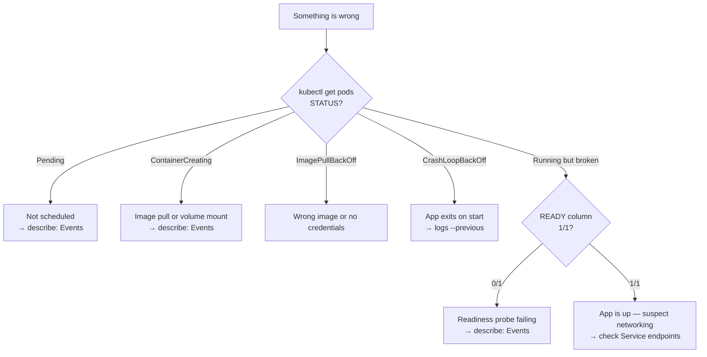

# Troubleshooting

> A method, then symptom-by-symptom fixes. Reference page — jump to your symptom.

---

## The method

Work outside-in. Four commands answer most problems:

```bash
kubectl get pods                 # 1. what is the STATUS?
kubectl describe pod <name>      # 2. what do the Events say?
kubectl logs <name> --previous   # 3. what did the app print before it died?
kubectl exec -it <name> -- sh    # 4. what does it look like from inside?
```



**Before anything else**, confirm you are on the right cluster and namespace:

```bash
kubectl config current-context
kubectl get pods -A | grep <name>
```

---

## Pod won't start

```bash
kubectl get pods
kubectl describe pod <name>          # Events at the bottom name the cause
kubectl logs <name>
kubectl logs <name> --previous       # the container instance before the last restart
```

`--previous` is the one people forget. After a crash loop the *current* container
has printed nothing useful — the evidence is in the previous one.

### STATUS values and what they mean

| STATUS | Cause | What to check |
| --- | --- | --- |
| `Pending` | Not scheduled to a node yet | `describe` Events — usually insufficient CPU/memory, an unsatisfiable `nodeSelector`/affinity, an untolerated taint, or an unbound PVC |
| `ContainerCreating` | Scheduled, still preparing | Normal for a few seconds. If stuck: image pull or volume mount — see Events |
| `ImagePullBackOff` / `ErrImagePull` | Cannot fetch the image | Typo in image name or tag; private registry with no `imagePullSecret`; no network from the node |
| `CrashLoopBackOff` | Container starts then exits repeatedly | `logs --previous`. Bad command, missing config, failed dependency, or the process is not designed to stay in the foreground |
| `CreateContainerConfigError` | Container config invalid | A referenced ConfigMap or Secret does not exist, or a key in it is missing |
| `RunContainerError` | Runtime refused to start it | Bad `command`/`args`, permission problems, invalid mount |
| `OOMKilled` (in Events / last state) | Exceeded its memory limit | Raise `resources.limits.memory` or fix the leak |
| `Terminating` (stuck) | Waiting on graceful shutdown or a finalizer | `--grace-period=0 --force`; check for finalizers in the object |
| `Evicted` | Node under resource pressure | Check node disk/memory; set proper requests |

### Running, but `READY 0/1`

The container is up but its **readiness probe** is failing, so it receives no
traffic:

```bash
kubectl describe pod <name>      # look for "Readiness probe failed"
kubectl get pod <name> -o jsonpath='{.status.conditions}'
```

Common causes: the probe path or port is wrong; the app takes longer to start than
`initialDelaySeconds` allows; the app is genuinely unhealthy.

---

## Service is unreachable

Work through the chain from the Service down to the container port.

### 1. Does the Service have endpoints?

```bash
kubectl get endpoints <service>
kubectl get endpointslices -l kubernetes.io/service-name=<service>
```

Empty means **the selector matches no ready Pods**. That is the most common cause.

### 2. Does the selector match the Pod labels?

```bash
kubectl get svc <service> -o jsonpath='{.spec.selector}'
kubectl get pods --show-labels
kubectl get pods -l <key>=<value>          # use the selector from above
```

If the third command returns nothing, the labels do not match.

### 3. Is `targetPort` the port the container really listens on?

```bash
kubectl get svc <service> -o yaml | grep -A3 ports
kubectl exec <pod> -- netstat -tlnp 2>/dev/null || kubectl exec <pod> -- ss -tlnp
```

`port` is what the Service exposes; `targetPort` must match the container's actual
listening port.

### 4. Test it from inside the cluster

```bash
kubectl run tmp --rm -it --image=busybox --restart=Never -- sh
# then, inside:
wget -qO- http://<service>.<namespace>.svc.cluster.local
nslookup <service>.<namespace>.svc.cluster.local
```

Or bypass the Service entirely to isolate the problem:

```bash
kubectl port-forward pod/<pod> 8080:80     # works? then the Pod is fine, suspect the Service
kubectl port-forward svc/<service> 8080:80 # works? suspect Ingress / external routing
```

### 5. DNS not resolving?

```bash
kubectl get pods -n kube-system -l k8s-app=kube-dns
kubectl logs -n kube-system -l k8s-app=kube-dns
```

---

## Node problems

```bash
kubectl get nodes
kubectl describe node <name>       # Conditions and Taints
kubectl top nodes                  # actual usage
```

| Condition | Meaning |
| --- | --- |
| `Ready=True` | healthy |
| `Ready=False` / `Unknown` | kubelet not reporting — check the kubelet/k3s service on that machine |
| `MemoryPressure=True` | low memory; Pods may be evicted |
| `DiskPressure=True` | low disk; image pulls fail, Pods evicted |
| `PIDPressure=True` | too many processes |

A **taint** on a node repels Pods that do not tolerate it — a frequent reason for
`Pending`:

```bash
kubectl get nodes -o jsonpath='{range .items[*]}{.metadata.name}{"\t"}{.spec.taints}{"\n"}{end}'
```

On k3s, the node is the machine running the service:

```bash
sudo systemctl status k3s
sudo journalctl -u k3s -f
```

---

## Resource and quota problems

```bash
kubectl describe pod <name> | grep -A5 -i "requests\|limits"
kubectl get resourcequota -n <namespace>
kubectl describe resourcequota -n <namespace>
kubectl top pods --containers
```

- `Pending` with "Insufficient cpu/memory" → the sum of **requests** exceeds what
  any node has free. Lower requests or add capacity.
- `OOMKilled` → the container exceeded its memory **limit**.
- Quota exceeded on create → the namespace `ResourceQuota` is full.

---

## Permission errors

```
Error from server (Forbidden): pods is forbidden: User "x" cannot list resource "pods"
```

```bash
kubectl auth can-i list pods                       # as yourself
kubectl auth can-i list pods --as=system:serviceaccount:default:my-sa
kubectl auth can-i --list                          # everything you can do
kubectl get rolebindings,clusterrolebindings -A -o wide | grep <name>
```

---

## Config and Secret problems

`CreateContainerConfigError` almost always means a missing reference:

```bash
kubectl get configmap,secret -n <namespace>
kubectl describe pod <name> | grep -i -A3 "configmap\|secret"
kubectl get configmap <name> -o yaml               # is the key actually there?
```

Remember that env-var injection is read **once at container start** — changing a
ConfigMap does not update a running container unless it is mounted as a volume.

---

## Seeing what the cluster has been doing

```bash
kubectl get events --sort-by=.lastTimestamp
kubectl get events -A --sort-by=.lastTimestamp | tail -30
kubectl get events --field-selector type=Warning
kubectl get events --field-selector involvedObject.name=<pod>
```

Events expire (about an hour by default), so check them while the problem is
fresh.

---

## When you cannot get a shell

Distroless and scratch images have no shell. Attach a debug container that does:

```bash
kubectl debug -it <pod> --image=busybox --target=<container>
kubectl debug node/<node> -it --image=busybox      # debug the node itself
```

---

## Quick command index

```bash
# triage
kubectl get pods -o wide
kubectl describe pod <name>
kubectl logs <name> --previous
kubectl get events --sort-by=.lastTimestamp

# networking
kubectl get endpoints <service>
kubectl get svc <service> -o yaml
kubectl port-forward pod/<pod> 8080:80

# nodes and resources
kubectl get nodes
kubectl describe node <name>
kubectl top nodes
kubectl top pods --containers

# permissions
kubectl auth can-i --list

# validate before applying
kubectl apply -f manifest.yaml --dry-run=server
kubectl diff -f manifest.yaml
```

---

[Contents](../README.md) · [kubectl](02-kubectl.md) ·
[Object reference](objects.md)
