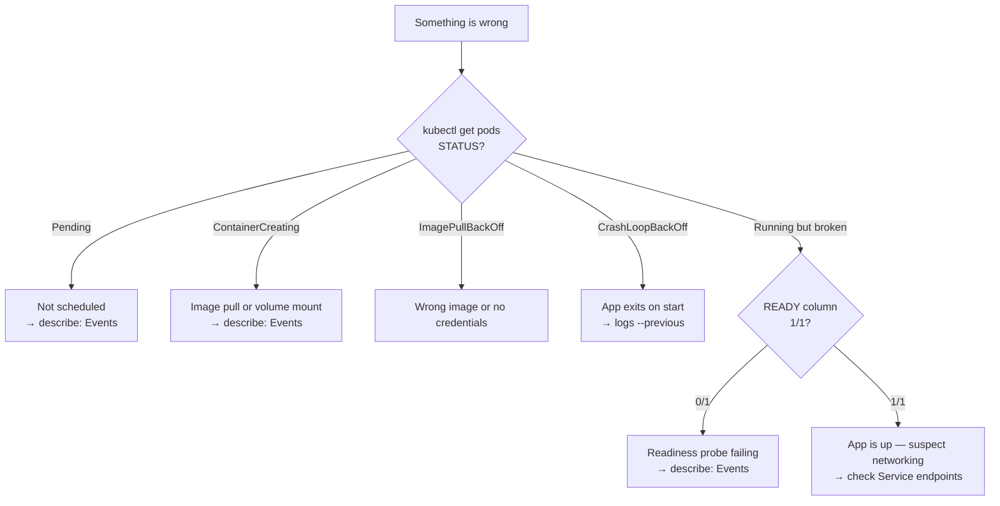

[English](troubleshooting.md) · **中文**

# 疑難排解

> 先是一套方法,再依症狀逐一排解。參考頁 —— 直接跳到你的症狀。

---

## 方法

由外而內。四個指令能回答大部分問題:

```bash
kubectl get pods                 # 1. STATUS 是什麼?
kubectl describe pod <name>      # 2. Events 說了什麼?
kubectl logs <name> --previous   # 3. app 在死掉前印了什麼?
kubectl exec -it <name> -- sh    # 4. 從裡面看是什麼樣子?
```



**在做任何事之前**,先確認你在對的叢集和命名空間:

```bash
kubectl config current-context
kubectl get pods -A | grep <name>
```

---

## Pod 起不來

```bash
kubectl get pods
kubectl describe pod <name>          # 底部的 Events 會指出原因
kubectl logs <name>
kubectl logs <name> --previous       # 上次重啟之前的那個容器實例
```

`--previous` 是大家會忘的那個。在崩潰迴圈之後,*目前*的容器什麼有用的都沒印 —— 證據在
上一個裡面。

### STATUS 各值的意義

| STATUS | 原因 | 該檢查什麼 |
| --- | --- | --- |
| `Pending` | 還沒被排到節點 | `describe` Events —— 通常是 CPU/記憶體不足、無法滿足的 `nodeSelector`/affinity、未容忍的 taint、或未綁定的 PVC |
| `ContainerCreating` | 已排程,還在準備 | 幾秒內正常。若卡住:image pull 或 volume mount —— 看 Events |
| `ImagePullBackOff` / `ErrImagePull` | 拉不到 image | image 名稱或 tag 打錯;私有 registry 沒有 `imagePullSecret`;節點沒網路 |
| `CrashLoopBackOff` | 容器啟動後反覆結束 | `logs --previous`。錯誤的 command、缺設定、相依失敗、或行程沒設計成停在前景 |
| `CreateContainerConfigError` | 容器設定無效 | 引用的 ConfigMap 或 Secret 不存在,或裡面缺一個 key |
| `RunContainerError` | runtime 拒絕啟動它 | 錯誤的 `command`/`args`、權限問題、無效的掛載 |
| `OOMKilled`(在 Events / last state 裡) | 超過它的記憶體 limit | 調高 `resources.limits.memory` 或修掉洩漏 |
| `Terminating`(卡住) | 在等優雅關閉或一個 finalizer | `--grace-period=0 --force`;檢查物件裡的 finalizers |
| `Evicted` | 節點資源壓力 | 檢查節點磁碟/記憶體;設定適當的 requests |

### Running,但 `READY 0/1`

容器起來了,但它的 **readiness probe** 失敗,所以它收不到流量:

```bash
kubectl describe pod <name>      # 找 "Readiness probe failed"
kubectl get pod <name> -o jsonpath='{.status.conditions}'
```

常見原因:probe 的 path 或 port 錯了;app 啟動比 `initialDelaySeconds` 允許的還久;app
真的不健康。

---

## Service 連不到

沿著這條鏈從 Service 往下排到容器 port。

### 1. Service 有 endpoints 嗎?

```bash
kubectl get endpoints <service>
kubectl get endpointslices -l kubernetes.io/service-name=<service>
```

空的表示 **selector 沒對到任何 ready 的 Pod**。這是最常見的原因。

### 2. selector 對得上 Pod 的標籤嗎?

```bash
kubectl get svc <service> -o jsonpath='{.spec.selector}'
kubectl get pods --show-labels
kubectl get pods -l <key>=<value>          # 用上面的 selector
```

如果第三個指令什麼都沒回,表示標籤不相符。

### 3. `targetPort` 是容器真正監聽的 port 嗎?

```bash
kubectl get svc <service> -o yaml | grep -A3 ports
kubectl exec <pod> -- netstat -tlnp 2>/dev/null || kubectl exec <pod> -- ss -tlnp
```

`port` 是 Service 對外開的;`targetPort` 必須對上容器實際監聽的 port。

### 4. 從叢集內部測試

```bash
kubectl run tmp --rm -it --image=busybox --restart=Never -- sh
# 然後在裡面:
wget -qO- http://<service>.<namespace>.svc.cluster.local
nslookup <service>.<namespace>.svc.cluster.local
```

或完全繞過 Service 來隔離問題:

```bash
kubectl port-forward pod/<pod> 8080:80     # 通?那 Pod 沒問題,懷疑 Service
kubectl port-forward svc/<service> 8080:80 # 通?懷疑 Ingress / 外部路由
```

### 5. DNS 解析不了?

```bash
kubectl get pods -n kube-system -l k8s-app=kube-dns
kubectl logs -n kube-system -l k8s-app=kube-dns
```

---

## 節點問題

```bash
kubectl get nodes
kubectl describe node <name>       # Conditions 和 Taints
kubectl top nodes                  # 實際用量
```

| Condition | 意義 |
| --- | --- |
| `Ready=True` | 健康 |
| `Ready=False` / `Unknown` | kubelet 沒回報 —— 檢查那台機器上的 kubelet/k3s 服務 |
| `MemoryPressure=True` | 記憶體低;Pod 可能被驅逐 |
| `DiskPressure=True` | 磁碟低;image pull 失敗、Pod 被驅逐 |
| `PIDPressure=True` | 行程太多 |

節點上的 **taint** 會排斥不容忍它的 Pod —— 是 `Pending` 的常見原因:

```bash
kubectl get nodes -o jsonpath='{range .items[*]}{.metadata.name}{"\t"}{.spec.taints}{"\n"}{end}'
```

在 k3s 上,節點就是跑那個服務的機器:

```bash
sudo systemctl status k3s
sudo journalctl -u k3s -f
```

---

## 資源與配額問題

```bash
kubectl describe pod <name> | grep -A5 -i "requests\|limits"
kubectl get resourcequota -n <namespace>
kubectl describe resourcequota -n <namespace>
kubectl top pods --containers
```

- `Pending` 帶「Insufficient cpu/memory」→ **requests** 的總和超過任何節點的空閒量。調低
  requests 或加容量。
- `OOMKilled` → 容器超過它的記憶體 **limit**。
- 建立時配額超限 → 命名空間的 `ResourceQuota` 滿了。

---

## 權限錯誤

```
Error from server (Forbidden): pods is forbidden: User "x" cannot list resource "pods"
```

```bash
kubectl auth can-i list pods                       # 以你自己的身分
kubectl auth can-i list pods --as=system:serviceaccount:default:my-sa
kubectl auth can-i --list                          # 你能做的每件事
kubectl get rolebindings,clusterrolebindings -A -o wide | grep <name>
```

---

## Config 與 Secret 問題

`CreateContainerConfigError` 幾乎總是表示引用缺失:

```bash
kubectl get configmap,secret -n <namespace>
kubectl describe pod <name> | grep -i -A3 "configmap\|secret"
kubectl get configmap <name> -o yaml               # key 真的在裡面嗎?
```

記住環境變數注入是在容器啟動時讀**一次** —— 改 ConfigMap 不會更新一個正在跑的容器,除非
它是掛成 volume。

---

## 看叢集一直在做什麼

```bash
kubectl get events --sort-by=.lastTimestamp
kubectl get events -A --sort-by=.lastTimestamp | tail -30
kubectl get events --field-selector type=Warning
kubectl get events --field-selector involvedObject.name=<pod>
```

Events 會過期(預設約一小時),所以趁問題還新鮮時檢查它們。

---

## 當你拿不到 shell

Distroless 和 scratch image 沒有 shell。掛一個有 shell 的除錯容器上去:

```bash
kubectl debug -it <pod> --image=busybox --target=<container>
kubectl debug node/<node> -it --image=busybox      # 除錯節點本身
```

---

## 快速指令索引

```bash
# 分診
kubectl get pods -o wide
kubectl describe pod <name>
kubectl logs <name> --previous
kubectl get events --sort-by=.lastTimestamp

# 網路
kubectl get endpoints <service>
kubectl get svc <service> -o yaml
kubectl port-forward pod/<pod> 8080:80

# 節點與資源
kubectl get nodes
kubectl describe node <name>
kubectl top nodes
kubectl top pods --containers

# 權限
kubectl auth can-i --list

# apply 前先驗證
kubectl apply -f manifest.yaml --dry-run=server
kubectl diff -f manifest.yaml
```

---

[目錄](../README.md) · [kubectl](02-kubectl.zh.md) ·
[物件參考](objects.zh.md)
